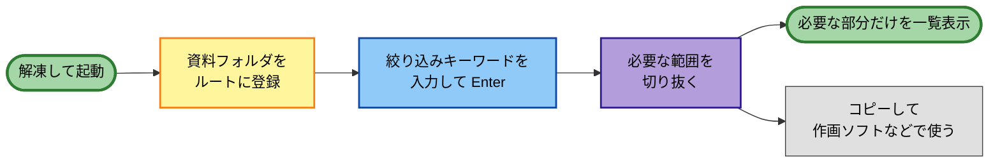
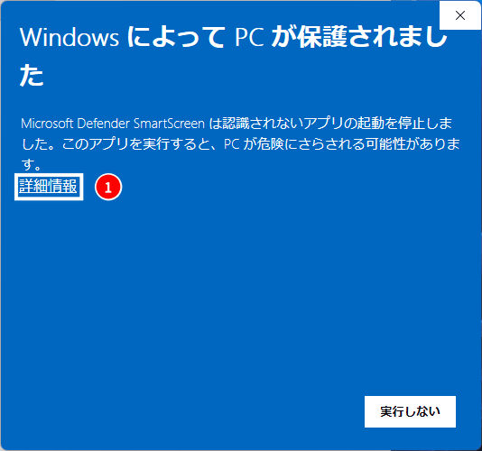
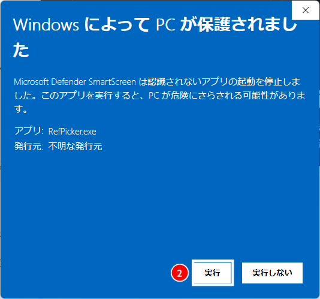

# QUICKSTART — RefPicker

ダウンロードから「最初の絞り込み」までの最短手順です。詳しい使い方は [USER_GUIDE.md](./USER_GUIDE.md) を参照してください。

個人で利用する場合のワークフローです。チーム・スタジオで資料を配る／受け取る場合は [同期ガイド](./SYNC_GUIDE.md) を参照してください。

---

## 1. 解凍して起動

1. [リリースページ](https://github.com/animtools/RefPicker/releases)から `RefPicker-vX.Y.Z-win64.zip` をダウンロードし、任意の場所に解凍
2. `RefPicker.exe` をダブルクリックして起動（インストール不要）

> **SmartScreen の警告が出たら**: 未署名のため「Windows によって PC が保護されました」と表示されることがあります。「詳細情報」→「実行」で起動できます。

> **アプリの更新をする際は、`RefPicker.exe` だけを上書きしてください。**
> ⚠ **解凍先のフォルダごと消さないでください。** あなたのデータ（索引・切り抜き・タグ・
> プロジェクト）は、この **exe と同じフォルダの `RefPickerData`** に入っています。
> フォルダごと消すと**それらが全て消えます**。ZIP の中身は `RefPicker.exe` と `README.txt` だけ
> なので、exe を上書きすれば更新は済みます。
>
> 起動中のバージョンは **設定 →「情報」タブ**（および設定ウィンドウのタイトルバー）で確認できます。
> 保存先の実際のパスは 設定 →「基本」→ **「データ保存先」** で見られます（変更もできます）。

## 2. 資料フォルダを登録する

1. 画面右上の **「設定を開く」**（歯車アイコン）を押す
2. **ルートフォルダ** に、参照したい設定資料のフォルダを追加
3. RefPicker が配下を自動でスキャンし、索引を作ります（設定資料のフォルダは移動もコピーもしません）

> **この時点では一覧はまだ空です。** RefPicker は全件を眺めるツールではなく、**絞ってから見る**ツールなので、
> 次の手順で語を入れて **Enter** を押すまで何も表示されません

## 3. 参照を絞り込む

1. 画面上部の **絞り込みキーワード** に語句を入力して **Enter** で確定すると入力した語句が画像のファイルパスやセットされたタグに部分一致した画像が表示されます
2. 複数の条件は以下のように入力します
   - **カンマ（`,` `，` `、`）で OR** — `主人公, ヒロイン` → どちらかに当たるもの
   - **プラス（`+` `＋`）で AND** — `主人公+顔` → 両方に当たるもの
   - **スペースや中黒では区切られません**
3. よく使う条件は **履歴** から呼び出せます

## 4. 並べて一覧表示

1. 画像上で **切り抜きツール**（多角形／矩形）を選び、必要部分を囲む
2. 集めた切り抜きを **絞り込み**、一覧で並べて見ながら参照できます。
   - 一覧の **表示単位を `切抜`** に切り替えると、画像単位ではなく**切り抜き範囲の単位**で並びます
   - **ピン**（中クリック、または **P** キー）に画像や切り抜きを集めると、右サイドバーにピン止めして必要なものだけをまとめておくことができます

**以上が基本の使い方です。**

> **切り抜き範囲を貼って使いたいときは**
> 切り抜きを右クリック →「**クリップボードへコピー**」で作画ソフトへ貼り付け、
> または「**フォルダへ書き出し**」でファイルとして書き出せます。

---

これで基本の流れは完了です。メジャー正規化・対比表・**プロジェクトの共有**（配る／受け取る）などは
[USER_GUIDE.md](./USER_GUIDE.md) を参照してください。

> ここまでの操作（索引化・絞り込み・切り抜き・書き出し）と**共有プロジェクトの受け取り**は、
> **ライセンス認証なしで**使えます。詳しくは [LICENSE](./LICENSE) の「4. 料金とライセンス認証」を参照してください。
