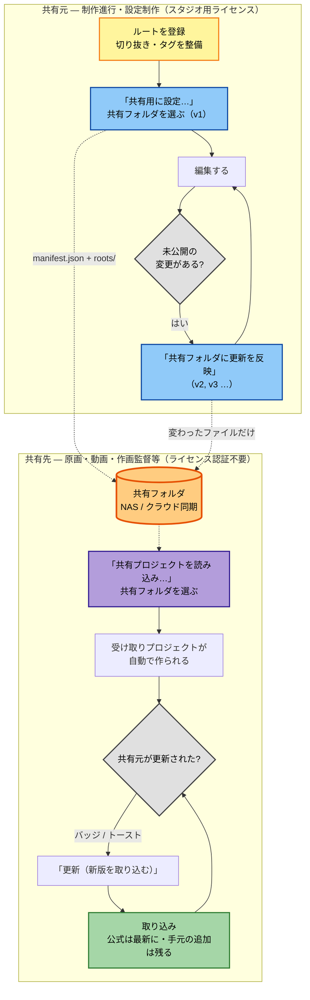

# RefPicker 同期ガイド

制作進行（共有元）とアニメーター（受け取り）の間で、**公式設定データ**をプロジェクト単位で配布・更新する手順をまとめたドキュメントです。

- 対象OS: Windows
- 関連: [ユーザーガイド](USER_GUIDE.md)（全体操作。**まずどちら側かを知りたい方は §1.3**）

---

> **ライセンスについて**
> **共有先はライセンス認証不要です。** 受け取る件数の制限もありません。
> **共有元(プロジェクトを公開・更新する側)にはスタジオ用のライセンスが必要です。**
> 詳しくは [スタジオ用ライセンスのご案内](https://animtools.github.io/RefPicker/landing/buy/studio.html)。

> アプリのスクリーンショットはすべて、デモ用に生成した**架空の設定資料**で撮影しています。

## 1. 同期のしくみ（概要）

### 1.1 何が同期されるか

| 対象 | 同期 |
|------|------|
| 共有元が登録したルートと、その切り抜き・タグ・メジャー等（**公式**） | ✅ プロジェクトパッケージで配布 |
| 受け取った側が自分で追加したフォルダ（**個人ルート**）、自分で作った切り抜き、追加したタグ | ❌ 配布しない（受け取った PC の中だけ） |

> 共有元のプロジェクトで登録したルートはすべて「公式ルート」という扱いになり、設定のルート一覧にも「公式」と表示されます。「個人ルート」は、受け取ったプロジェクトに自分で追加したルートのことを指します。

### 1.2 プロジェクトの種別

プロジェクトが **共有元** か **受け取り** かは**データから自動判定**されます。

| 種別 | どういうプロジェクトか |
|-----------|----------|
| **共有元** | 自分で作って編集し、**「共有用に設定」** で更新を反映するプロジェクト（すべてのデータが編集できます） |
| **受け取り** | パッケージを取り込んで作られたプロジェクト。**配られた切り抜きの形状や同期元タグは変更できません**が、タグの追加・自分の切り抜きの作成・個人ルートの追加はできます。**共有用に設定することはできません** |

> **原則: いま編集しているプロジェクトは、取り込みで書き換わりません。**
>
> - 取り込み先は**必ず受け取り用のプロジェクト**で、共有元ごとに新しく作られます
> - **「更新」を押すまで取り込みません**（自動で反映されることはありません）
> - 置き換えの前に、**プロジェクトのデータを自動で退避**します

> **プロジェクトの共有と移行は別物**：本ガイドは**共有**（公式データを配布し、共有先は購読・読み取り専用・バージョン更新）を扱います。プロジェクト**丸ごと**を別PC等へ移す場合は「移行」（ツールバーの **「プロジェクトを書き出し」／「プロジェクトを読み込み」**）を使います。詳細は [USER_GUIDE.md](USER_GUIDE.md) の「プロジェクトの移行」章。

### 1.3 共有プロジェクトの実態について

共有フォルダはディスク上に **フォルダ** にまとめられて配置されます。（NAS でもクラウド同期フォルダでも配置可能）。

NAS・Google Drive / OneDrive / Dropbox 等のミラー先を指定すると、そのフォルダ内の `manifest.json` から更新を検知し、新しいバージョンがあると通知します。

### 1.4 共有フォルダに置かれるファイル

共有元が **「共有用に設定」／「共有フォルダに更新を反映」** するたびに、指定フォルダへ次が書き出されます。

| 置かれるもの | 内容 |
|----------|------|
| `manifest.json` | バージョン番号・プロジェクトの識別子・配布元と、**フォルダ内の全ファイルの一覧**（ファイルごとの照合用の値つき） |
| `roots/…` | 公式設定データの実ファイル（画像・メタデータ）を、**そのままのフォルダ構造で** |

共有先は **manifest の `version` が手元より大きい** と更新ありと判断します。

> 共有フォルダを手でコピーして渡すときは、**`manifest.json` と `roots` をセットで**置いてください。`manifest.json` だけでは、実体のファイルが無いので取り込めません。

### 1.5 更新の知らせ方

- **バックグラウンドでの検知**：約 60 秒間隔で受け取った全プロジェクトを横断チェックして変更があった場合に**更新バッジ**が表示されます。
- **メインウィンドウにフォーカスが戻ったとき**: 未処理の更新を **トースト**（「後で」「更新」）で表示
- 設定「プロジェクト」タブでは、新しいバージョンがあると **「更新（新版を取り込む）」** ボタンが出ます。

---

## 2. 初回セットアップ（共通）

自動で取り込まれることはありません。共有先が<b>「更新」を押したとき</b>に取り込まれます。

すべて設定ウィンドウ **「プロジェクト」** タブ上部の**ツールバー**（共有用に設定／共有プロジェクトを読み込み…／プロジェクトを書き出し／プロジェクトを読み込み）から操作します。役割や同期チャネルの設定はありません。

### 2.1 共有元の準備（共有する側）

更新を反映するとバージョンが1つ上がります。<b>まだ配っていない変更</b>は下に一覧で出ます。

1. メイン画面 **設定を開く** → **プロジェクト** タブ。
2. プロジェクトを選ぶ（または **新規作成**）。
3. **ルート** タブの **「ルートを追加」** で画像フォルダを登録。スキャン完了を待つ。
4. 切り抜き・タグ・メジャーを整備する。
5. ツールバーの **「共有用に設定…」** を押し、**共有フォルダ**（共有/クラウドフォルダ）を選ぶ（初回はバージョン v1）。以後、そのフォルダが記憶されます。

以後、編集して未公開の変更ができると **「共有フォルダに更新を反映」** ボタンが出ます。押すと記憶した共有フォルダへ、バージョンを上げて書き出します。公開前に **未公開の変更** 一覧で差分を確認できます。

### 2.2 受け取りの初回取り込み（受け取る側）

取り込む前に、何が入るかを確認できます。

ツールバーの **「共有プロジェクトを読み込み…」** を押し、**共有元の共有フォルダ**（`manifest.json` がある所）を選びます（[§1.2 の原則](#12-プロジェクトの種別)のとおり、受け取り用のプロジェクトが新しく作られます）。

選んだフォルダは **共有フォルダとして記憶され、以後の新しいバージョンは自動で検知・通知**されます。

初回は「新しい受け取りプロジェクト『◯◯』を作成して取り込みます」と確認が出ます。

> 同じ共有元の次のバージョンは、**同じ受け取りプロジェクトへ更新**として積み上がります（別のプロジェクトとは混ざりません）。フォルダから受け取っていれば、新しいバージョンは **「更新（新版を取り込む）」** で取り込めます。

---

## 3. 共有プロジェクトの更新（日常運用）

1. 共有元が編集し、**「共有フォルダに更新を反映」** を押します（バージョンが 1 ずつ上がります）。
2. 共有フォルダへ `manifest.json` と変更のあったファイルが届くのを待ちます（NAS・クラウドでは遅れることがあります）。
3. 共有先で更新を知る:
   - プロジェクト切替の **更新** バッジ
   - メインに戻ったときの **トースト**
   - 設定「プロジェクト」タブの **「更新（新版を取り込む）」** ボタン
4. トーストやプロジェクト切替の **「更新」**、または **「更新（新版を取り込む）」** を押すと取り込みます。

**取り込んだあとの状態**

- 共有元のデータ（切り抜きの形状・同期元タグ・メジャーなど）は、共有元の最新にそろいます。これらは共有先から変更・削除できません。
- 手元で足したタグ・自分で作った切り抜き・個人ルートは残ります。共有元がタグを変えても、手元で足したタグは残ります。

**複数の作品を受け取る（共有先の方へ）**

受け取りプロジェクトは、共有元のプロジェクトごとに**自動で作られます**。自分でプロジェクトを用意する必要はありません。

1. 作品ごとの共有フォルダを **「共有プロジェクトを読み込み…」** で受け取ると、それぞれ別の受け取りプロジェクトになります。同じ共有元の次のバージョンは、同じ受け取りプロジェクトに入ります。
2. メイン画面上部左の **プロジェクト切替** で、見たいプロジェクトを選びます。表示は `配布元 / プロジェクト名`（配布元が未設定ならプロジェクト名のみ）です。
3. プロジェクトごとに共有フォルダを記憶し、**バックグラウンドで更新を検知**します。更新があるプロジェクトには **更新** バッジが付きます（**開いていないプロジェクトも含む**）。
4. 開いていないプロジェクトの更新は、プロジェクト切替メニュー内の **「更新」** から取り込めます。**いま開いているプロジェクトは切り替わりません**。
5. 設定の **「配布元」**（表示ラベル）にスタジオ名などを入れておくと、プロジェクトの見分けがつきやすくなります。

---

## 4. 共有フォルダの置き方（パターン別）

共有フォルダは、**共有元と共有先の両方の PC から開けるフォルダ**なら、置き場所は問いません。環境に合わせて次のどれかを選びます。

| パターン | 向いている環境 |
|---|---|
| 4.1 社内の NAS・共有フォルダ | 共有元と共有先が同じ社内ネットワークにいる |
| 4.2 クラウド同期フォルダ | 社外のスタッフに配る・在宅で作業する |
| 4.3 フォルダを手渡しする | ネットワークで共有できない |

どのパターンでも、共有先の PC で開くパスは、共有元の PC と違っていて構いません。

### 4.1 社内の NAS・共有フォルダ

1. **共有元**: NAS や社内の共有フォルダに、作品ごとの配布用フォルダを作ります。
2. **共有元**: **「共有用に設定…」** で、そのフォルダを選びます（バージョン v1）。
3. **共有先**: 同じフォルダを **「共有プロジェクトを読み込み…」** で選びます。
4. 以後、共有元が **「共有フォルダに更新を反映」** すると、共有先では約 60 秒ごとの検知で更新バッジが付きます（メイン画面に戻ったときはトーストでも知らせます）。

### 4.2 クラウド同期フォルダ（Google Drive／OneDrive／Dropbox）

**クラウド同期フォルダ**（クラウドサービスが PC 上に作るフォルダ）の中に、共有フォルダを置きます。

**共有元**

1. 使うサービスのデスクトップアプリ（例: [Google Drive for desktop](https://www.google.com/drive/download/)）をインストールし、ログインします。
2. クラウド同期フォルダの中に、作品ごとの配布用フォルダを作ります（例: `G:\マイ ドライブ\RefPicker\第1話`。ドライブ文字や表示名は環境によって違います）。
3. **「共有用に設定…」** で、そのフォルダの **PC 上のパス** を選びます（ブラウザで開く URL ではありません）。
4. そのフォルダを、共有先のアカウントと共有します。

**共有先**

1. 共有されたフォルダを自分のクラウド同期フォルダに入れ、同期が終わるまで待ちます（Google Drive では **ドライブに追加**）。
2. エクスプローラーでそのフォルダを開き、`manifest.json` と `roots` フォルダが見えることを確かめます。
3. **「共有プロジェクトを読み込み…」** で、そのフォルダの **自分の PC 上のパス** を選びます。

**注意**

- クラウドを経由して届くまで、数秒〜数分かかることがあります。更新バッジが付かないときは、フォルダ内の `manifest.json` が新しくなっているか確かめてください。
- オフライン・容量不足・「ストリーミングのみ」などの設定になっていないかも確認してください。
- `manifest.json` や `roots` の中身は、手で編集しないでください。

### 4.3 フォルダを手渡しする（ネットワークを使わない）

1. **共有元**: **「共有用に設定…」** で、配布用の新しいフォルダを共有フォルダに選びます。
2. **共有元**: そのフォルダを**中身ごと**、USB メモリや外付けドライブにコピーして渡します（`manifest.json` だけでは取り込めません）。
3. **共有先**: 受け取ったフォルダを自分の PC に置き、**「共有プロジェクトを読み込み…」** で選びます。
4. 次のバージョンも同じようにフォルダごと受け取り、**前と同じ場所に上書き**してから **「更新（新版を取り込む）」** を押します。

> 手渡しでは、フォルダを置き換えるまで更新は通知されません。

---

## 5. トラブルシュート

### 更新バッジが付かない

- その受け取りプロジェクトを **フォルダから受け取った** か（共有フォルダを記憶していないと更新を検知しません）。
- **共有フォルダ** が共有元の共有フォルダと **同じクラウド／共有フォルダ** を指しているか（設定「共有」節に表示される「共有フォルダ: …」で確認）。
- フォルダに `manifest.json` があり、`version` が手元で取り込み済みのバージョンより大きいか。

### 更新を適用できない

- 共有フォルダの中身が **manifest と一致** しているか（`roots` 以下のファイルが揃っているか。ずれていれば共有元が公開し直す）。
- 共有元が **公開** 済みか（手元のフォルダだけを差し替えていないか）。

### 「購読先 (…) が一致しません」「発行元プロジェクトには取り込めません」

- **別のプロジェクトの共有フォルダ** を、別の共有元を購読している受け取りプロジェクトへ当てようとしていないか。プロジェクトごとに受け取りプロジェクトは分かれます（初回は自動で新規作成されます）。
- **共有元プロジェクト**（自分が公開している側）には取り込めません。受け取りは別の受け取りプロジェクトに作られるので、共有元の正本が上書きされることはありません。

### 「共有元がこの共有を終了しました」と出る

- 共有元が **「共有を終了…」** を実行しました。共有フォルダには終了の印（`share-ended.json`）だけが残っています。
- 受け取りプロジェクトは**読み取り専用のまま手元に残ります**。受け取った資料はそのまま使えますが、更新はもう届きません。
- 不要ならプロジェクトを削除してください。受け取りプロジェクトを編集できるプロジェクトに変える操作はありません。
- 「**共有元が共有を終了した可能性があります**」と出るのは、共有フォルダに配布データも終了の印も見つからないときです（共有元がフォルダごと消した場合など）。共有元に確認してください。
- 終了したフォルダを **「共有プロジェクトを読み込み…」** で選ぶと「このフォルダの共有は共有元が終了しています」と表示され、受け取れません。
- 共有元が同じ共有フォルダで共有を再開すると、そのまま更新を受け取れます。

### 別のプロジェクトを更新しても、今の一覧は変わりません

- 通常は **開いているプロジェクトだけ** 一覧が自動更新される。別のプロジェクトの適用はバックグラウンド完了とバッジ解消のみ。

### トーストを「後で」にしたあとまた出したい

- **「後で」** は **その起動セッション中** は再表示されない。再起動後、未適用の更新があれば再度通知される。

### Google Drive で片方の PC にだけファイルがない

- Drive の同期状態アイコンを確認。共有フォルダは共有先のアカウントで **ドライブに追加** されているか。
  オフライン・容量不足・「ストリーミングのみ」設定も確認する。

---

## 6. クイックリファレンス（UI）

| 操作 | 場所 |
|------|------|
| 共有用に設定／共有プロジェクトを読み込み／更新（新版を取り込む）／共有フォルダに更新を反映／共有を終了／プロジェクトを書き出し・読み込み（移行） | 設定 → **プロジェクト**（上部ツールバー） |
| ルートの登録 | 設定 → **ルート** → **「ルートを追加」**（受け取ったプロジェクトでは **「個人ルートを追加」**） |
| プロジェクト切替・更新バッジ | メイン上部左 **プロジェクト切替** |
| 更新トースト | メイン画面上部（フォーカス復帰時など） |
| 配布元ラベル（表示用） | 設定 → プロジェクト → **「配布元」** |

---

## 7. 関連ドキュメント

- [USER_GUIDE.md](USER_GUIDE.md) — 画面全体・フィルタ・切り抜き等

