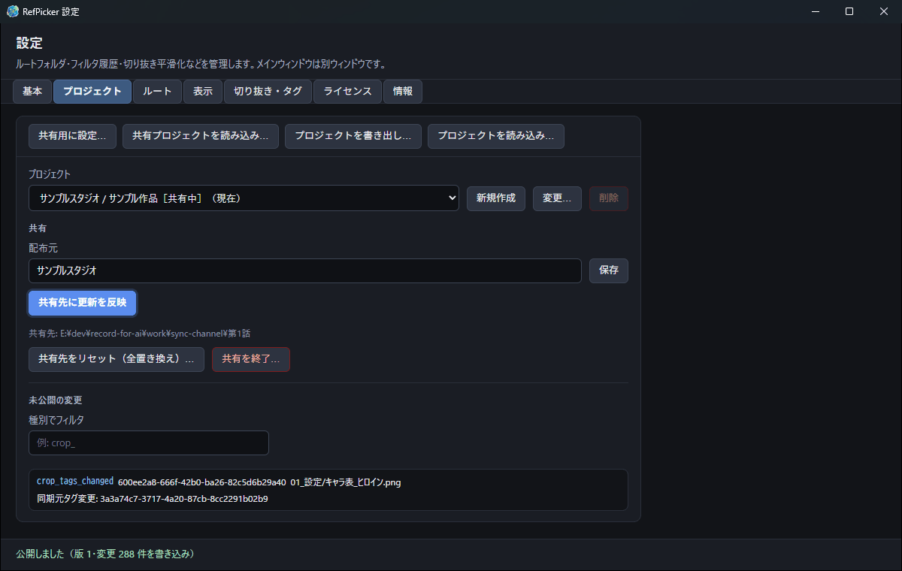
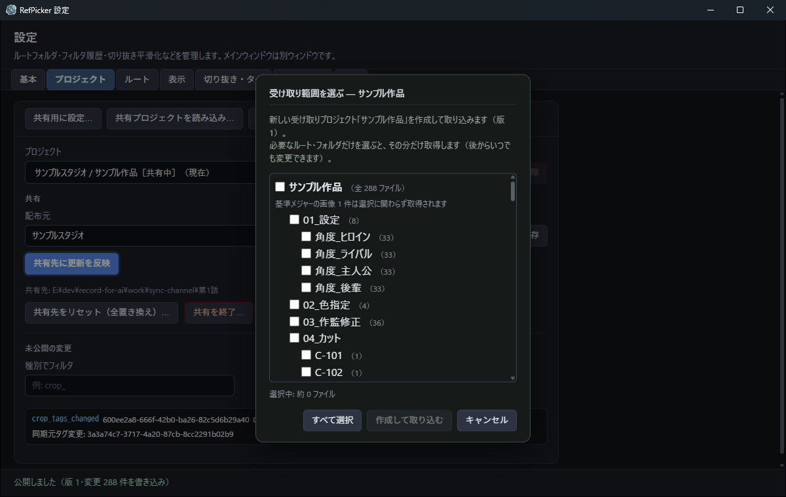
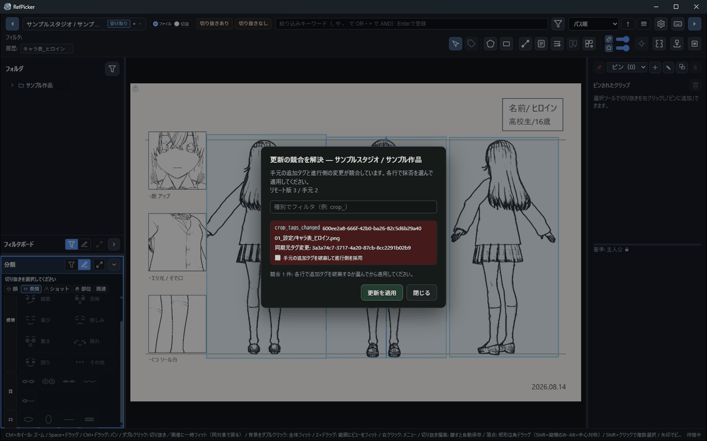

# RefPicker 同期ガイド

制作進行（発行元）とアニメーター（受け取り）の間で、**公式設定データ**をプロジェクト単位で配布・更新する手順をまとめたドキュメントです。

- 対象OS: 主に Windows
- 関連: [ユーザーガイド](USER_GUIDE.md)（全体操作）、`CONTEXT.md`（用語の正本）

---

> **ライセンスについて**
> **受け取る側は無料です。**認証も要らず、受け取れる件数の制限もありません。
> ライセンス（スタジオ用）が要るのは**配る側**——プロジェクトを公開・更新する人——だけです。
> 詳しくは [スタジオ用ライセンスのご案内](https://animtools.github.io/RefPicker/landing/buy/studio.html)。

> 画面写真はすべて、デモ用に生成した**架空の設定資料**で撮影しています。

## 1. 同期のしくみ（概要）

### 1.1 何が同期されるか

| 対象 | 同期 |
|------|------|
| **公式**ルート・切り抜き・同期元タグ・メジャー等 | ✅ プロジェクトパッケージで配布 |
| **個人**ルート（参考資料） | ❌ 同期しない（プロジェクトごとに手元のみ） |

### 1.2 役割（自動判定）

役割トグルはありません。プロジェクトが **発行元** か **受け取り** かは**データから自動判定**されます。

| 役割（自動） | どういうプロジェクトか |
|-----------|----------|
| **発行元** | 自分で作って編集し、**「共有用に設定」** で配信するプロジェクト（公式・個人とも編集可） |
| **受け取り** | パッケージを取り込んで作られたプロジェクト（**公式データは読み取り専用**・タグ追加のみ） |

> **安全設計（重要）**
> 受け取り取り込みは、**あなたが編集している発行元プロジェクトを決して上書きしません**。取り込みは常に**受け取りプロジェクト**に対してだけ行われ、発行元ごとに**新しい受け取りプロジェクトが作られます**（既存プロジェクトは壊れません）。適用前に必ず**プレビュー／確認**を挟み、置き換えの前に**プロジェクトDBを自動退避**します。

> **共有と移行は別物**：本ガイドは**共有**（公式データを配布し、受け取り側は購読・読み取り専用・版更新）を扱います。プロジェクト**丸ごと**を別PCへ持っていって**続きを編集**したい場合は「移行」（ツールバーの **「プロジェクトを書き出し」／「プロジェクトを読み込み」**）を使います。詳細は [USER_GUIDE.md](USER_GUIDE.md) の「プロジェクトの持ち運び（移行）」章。

### 1.3 配布先／受信元は「ただのフォルダ」

同期チャネル種別のコンボはありません。配布先／受信元は **ただのフォルダ**（NAS でもクラウド同期フォルダでも、ユーザーがどのフォルダを選ぶかの違いだけ）または **単体の ZIP** です。

- **フォルダ**（NAS・Google Drive / OneDrive / Dropbox 等のミラー先）: フォルダ内の `manifest.json` を監視し、新版があると通知します。以後の自動監視の対象になります。
- **単体 ZIP**（チャット・メール等で手渡し）: その場の取り込みのみ（自動監視なし）。

### 1.4 配布先フォルダに置かれるファイル

発行元が **「共有用に設定」／「配信先に更新を反映」** するたびに、指定フォルダへ次が書き出されます。

| ファイル | 内容 |
|----------|------|
| `manifest.json` | 版番号（`version`）、`projectId`、ZIP ファイル名・ハッシュ |
| `<案件名>-v<N>.crp-project.zip` | 公式設定データ一式（画像＋メタデータ） |

受け取り側は **manifest の `version` が手元より大きい** と更新ありと判断します。ZIP だけ・manifest だけでは正しく動きません。

### 1.5 更新の知らせ方

- **バックグラウンド監視**（約 60 秒間隔）: フォルダから受け取った全プロジェクトを横断チェック → **更新バッジ**
- **メインウィンドウにフォーカスが戻ったとき**: 未処理の更新を **トースト**（「後で」「更新」）で表示
- 設定「プロジェクト」タブでは、新版があると **「更新（新版を取り込む）」** ボタンが出ます。

自動適用はしません。必ずユーザーの明示操作です。

---

## 2. 初回セットアップ（共通）

すべて設定ウィンドウ **「プロジェクト」** タブ上部の**ツールバー**（共有用に設定／共有プロジェクトを読み込み ▾／プロジェクトを書き出し／プロジェクトを読み込み）から操作します。役割や同期チャネルの設定はありません。

### 2.1 発行元の準備（共有する側）

公開すると版が1つ上がります。<b>まだ配っていない変更</b>は下に一覧で出ます。

1. メイン画面 **設定を開く** → **プロジェクト** タブ。
2. プロジェクトを選ぶ（または **新規作成**）。
3. **ルート** タブで **公式ルートを追加** し、画像フォルダを登録。スキャン完了を待つ。
4. 切り抜き・タグ・メジャーを整備する。
5. ツールバーの **「共有用に設定…」** を押し、**配信先フォルダ**（共有/クラウドフォルダ）を選ぶ（初回は版 v1）。以後、配信先が記憶されます。

以後、編集して未公開の変更ができると **「配信先に更新を反映」** ボタンが出ます。押すと記憶した配信先へ版を上げて再公開します。公開前に **未公開の変更** 一覧で差分を確認できます。

### 2.2 受け取りの初回取り込み（bootstrap）

受け取りは<b>新しいプロジェクトを作って</b>取り込みます。いま使っているものを上書きしません。

ツールバーの **「共有プロジェクトを読み込み… ▾」** から、発行元の配布方法に応じて選びます。取り込むと**発行元ごとに新しい受け取りプロジェクトが自動作成**されます（他のプロジェクトは変更されません）。

- **フォルダを指定して読み込み**: 発行元の配布フォルダ（`manifest.json` がある所）を選ぶ。**受信元として記憶され、以後の新版は自動で監視・通知**されます。
- **ZIPを指定して読み込み**: 手渡しされた `*.crp-project.zip` を選ぶ（単発・監視なし）。

初回は「新しい受け取りプロジェクト『◯◯』を作成して取り込みます」と確認が出ます。

> 同じ発行元の次の版は、**同じ受け取りプロジェクトへ更新**として積み上がります（購読先＝パッケージの `projectId` で対応づけ。別案件とは混ざりません）。フォルダから受け取っていれば、新版は「更新（新版を取り込む）」で取り込めます。

---

## 3. 更新の受け取り（日常運用）

手元で足したタグと配信側の変更がぶつかったときは、<b>適用の前に</b>行ごとに選べます。

1. 発行元が編集し、**「配信先に更新を反映」**（版が 1 ずつ増える）。
2. 配布フォルダへ `manifest.json` と新しい ZIP が反映されるのを待つ（NAS・クラウドの遅延に注意）。
3. 受け取り側で更新を知る:
   - プロジェクト切替の **更新** バッジ
   - メインに戻ったときの **トースト**
   - 設定「プロジェクト」タブの **「更新（新版を取り込む）」** ボタン
4. **更新プレビュー** で変更内容を確認。
5. **「更新を適用」**（トーストの **「更新」** は、競合がなければワンクリック適用、競合ありならプレビューダイアログへ）。

**受け取り側の制約**

- 公式切り抜きは **タグの追加のみ** 可能（形状変更・削除は不可）。
- 進行が同期元タグを変え、手元に追加タグがある場合は **競合**。プレビューで「手元の追加タグを破棄して進行側を採用」を選んでから適用。

**複数案件**

- 案件ごとに **別プロジェクト**・別同期フォルダ。
- 開いていない案件もバッジ・トーストで通知。プロジェクト切替の **「プレビュー…」** から適用可能（今の案件は切り替わらない）。

---

## 4. テスト手順: 同一 PC（最短）

共有フォルダの代わりに **ローカルの空フォルダ** でも動作確認できます。クラウドの前にここで流れを覚えるのがおすすめです。

1. 空フォルダ `D:\RefPickerTest\第1話` を作る。
2. **発行元プロジェクト**: 公式ルート登録 → ツールバー **「共有用に設定…」** で上記フォルダを配信先に選ぶ（v1 公開）。
3. **別プロジェクト**で、ツールバー **「共有プロジェクトを読み込み… ▾ → フォルダを指定して読み込み」** で上記フォルダを選ぶ → v1 を取り込む（新しい受け取りプロジェクトが作られ、受信元フォルダを記憶）。
4. 発行元でタグ等を変更 → **「配信先に更新を反映」**（v2）。
5. 受け取り側（作成された受け取りプロジェクト）でバッジ／**「更新（新版を取り込む）」** → プレビュー → 適用。

---

## 5. テスト手順: Google Drive for PC

Google Drive のミラーフォルダを**配信先／受信元**に使います。社内 NAS の代わりに、リモート配布の練習に使えます。

### 5.1 事前準備

1. [Google Drive for desktop](https://www.google.com/drive/download/) をインストールし、ログインする。
2. エクスプローラーで Drive のローカルフォルダを開く。  
   例: `G:\マイ ドライブ` または `G:\共有ドライブ`（環境によりドライブ文字・表示名は異なります）。
3. テスト用フォルダを作る。例: `マイ ドライブ\RefPickerTest\第1話`。
4. フォルダが空であることを確認する。

### 5.2 パターン A — 1 台の PC

| 手順 | 発行元プロジェクト | 受け取りプロジェクト（別プロジェクト） |
|------|-------------------|---------------------|
| 1 | 公式ルート登録 | （後でフォルダから読み込み） |
| 2 | **「共有用に設定…」** → 上記 Drive フォルダ（v1 公開） | **「共有プロジェクトを読み込み ▾ → フォルダを指定して読み込み」** で同じフォルダ → v1 取り込み（受信元を記憶） |
| 3 | 編集 → **「配信先に更新を反映」**（v2） | バッジ／トースト → **「更新（新版を取り込む）」** → プレビュー → 適用 |

同一 PC ではローカルパスは発行元・受け取りで **同じ** になります。Drive のクラウド往復はほぼ即時ですが、アプリの監視は最大約 60 秒です。すぐ試すときは一度別アプリに切り替えてメインに戻るとトーストが出やすくなります。

### 5.3 パターン B — 2 台の PC（本番に近い）

**PC1（発行元）**

1. Drive 上に配布用フォルダを作る（例: `RefPickerTest\第1話`）。
2. RefPicker で公式ルートを整備 → **「共有用に設定…」** で **PC1 上のそのフォルダ**を配信先に指定（v1 公開）。

**PC2（受け取り）**

1. 同じ Google アカウント、または **共有** して受け取り側の Drive にフォルダが見えるようにする。  
   別アカウントの場合は、共有フォルダを **ドライブに追加** してから同期完了を待つ。
2. エクスプローラーで `manifest.json` と `*-v1.crp-project.zip` が見えることを確認。
3. **「共有プロジェクトを読み込み ▾ → フォルダを指定して読み込み」** で、**PC2 上の同じクラウドフォルダのローカルパス**を選ぶ（パス文字列は PC1 と異なってよい）。受け取りプロジェクトが作られ、受信元を記憶。

**更新テスト**

PC1 で編集 → **「配信先に更新を反映」** → Drive 同期完了を待つ → PC2 でバッジ／トースト →**「更新（新版を取り込む）」**→ 適用。

### 5.4 Google Drive で注意すること

- **同期遅延**: manifest や ZIP がクラウド経由で届くまで数秒〜数分かかることがある。フォルダ内の `manifest.json` の `version` をエクスプローラーで確認してから待つ。
- **パスはローカルミラー**: アプリに渡すのは `G:\...` など **PC 上のパス**。ブラウザの Drive URL ではない。
- **編集は RefPicker から**: `manifest.json` や ZIP を手編集しない。
- **OneDrive / Dropbox** も手順は同様（配信先/受信元にそのミラーフォルダを選ぶだけ）。

---

## 6. 手動 ZIP のみで配布する場合

1. 発行元: **「共有用に設定」** で書き出した配布フォルダの `*.crp-project.zip` をそのまま（チャット・USB 等で）渡す。
2. 受け取り: **「共有プロジェクトを読み込み ▾ → ZIPを指定して読み込み」** で取り込む（初回は受け取りプロジェクトが作られる）。以降も新しい ZIP を同じ導線で都度取り込む（同じ発行元なら同じ受け取りプロジェクトへ更新として入る）。  
   自動の更新バッジ・トーストは **フォルダから受け取った** 場合のみ。

---

## 7. トラブルシュート

### 更新バッジが付かない

- その受け取りプロジェクトを **フォルダから受け取った** か（ZIP を指定して読み込んだものは監視されません）。
- **受信元** が発行元の配布フォルダと **同じクラウド／共有フォルダ** を指しているか（設定「共有」節に表示される「受信元: …」で確認）。
- フォルダに `manifest.json` があり、`version` が手元の適用済み版より大きいか。

### プレビューが空・適用できない

- 同期フォルダに **ZIP ファイル名が manifest と一致** しているか（公開し直して揃える）。
- 発行元が **公開** 済みか（ZIP を手元でだけ置き換えていないか）。

### 「購読先と一致しません」「発行元プロジェクトには取り込めません」

- **別案件の ZIP** を、別の発注元を購読している受け取りプロジェクトへ当てようとしていないか。案件ごとに受け取りプロジェクトは分かれます（初回は自動で新規作成されます）。
- **発行元プロジェクト**（自分が公開している側）には取り込めません。受け取りは別の受け取りプロジェクトに作られるので、発行元の正本が上書きされることはありません。

### 別案件を更新したのに、今見ている一覧が変わった

- 通常は **開いているプロジェクトだけ** 一覧が自動更新される。別案件の適用はバックグラウンド完了とバッジ解消のみ。

### トーストを「後で」にしたあとまた出したい

- **「後で」** は **その起動セッション中** は再表示されない。再起動後、未適用の更新があれば再度通知される。

### Google Drive で片方の PC にだけファイルがない

- Drive の同期状態アイコンを確認。共有フォルダは受け取り側アカウントで **ドライブに追加** されているか。  
  オフライン・容量不足・「ストリーミングのみ」設定も確認する。

---

## 8. クイックリファレンス（UI）

| 操作 | 場所 |
|------|------|
| 共有用に設定／共有プロジェクトを読み込み▾（フォルダ・ZIP）／更新（新版を取り込む）／配信先に更新を反映／プロジェクトを書き出し・読み込み（移行） | 設定 → **プロジェクト**（上部ツールバー） |
| 公式ルート登録 | 設定 → **ルート** |
| プロジェクト切替・更新バッジ・プレビュー | メイン上部左 **プロジェクト切替** |
| 更新トースト | メイン画面上部（フォーカス復帰時など） |
| 発注元ラベル | 設定 → プロジェクト → **発注元（表示ラベル）** |

---

## 9. 関連ドキュメント

- [USER_GUIDE.md](USER_GUIDE.md) — 画面全体・フィルタ・切り抜き等
- [docs/adr/0002-project-sync-model.md](adr/0002-project-sync-model.md) — 同期モデルの設計決定
- [docs/adr/0003-multi-project-subscriber-sync.md](adr/0003-multi-project-subscriber-sync.md) — 複数案件の並行受け取り
- [docs/adr/0004-background-update-watch-and-activation-toasts.md](adr/0004-background-update-watch-and-activation-toasts.md) — 更新監視とトースト
