# RefPicker ユーザーガイド

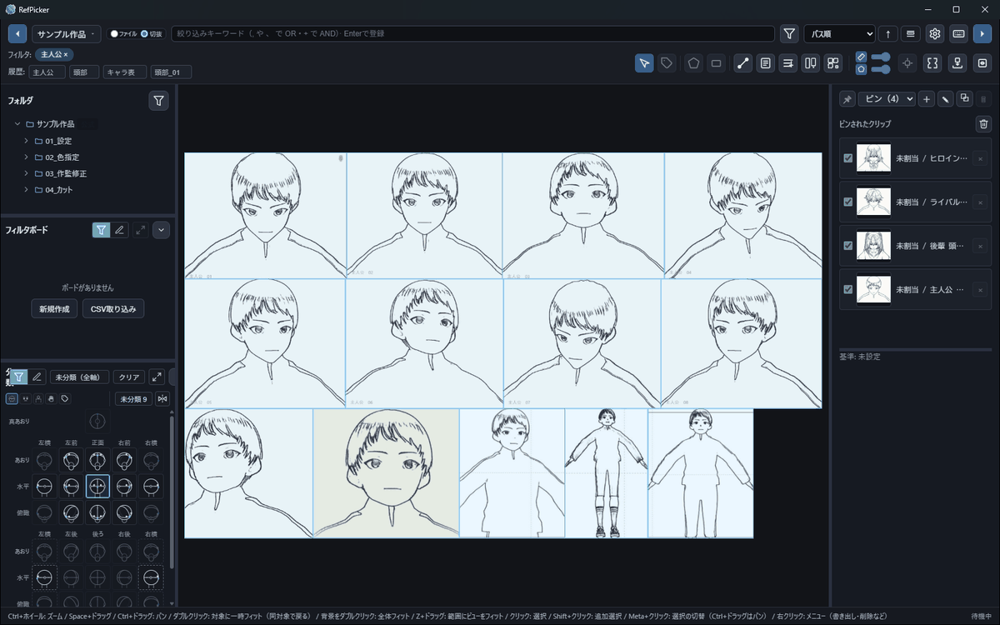

この画面がこの道具の目的です。<b>必要な範囲だけを取り出して、並べて見る</b>。以下はそこへ至る手順です。

> 画面写真はすべて、デモ用に生成した**架空の設定資料**で撮影しています。

このドキュメントは、RefPicker を **実際のUI表記に合わせて**説明するエンドユーザー向けマニュアルです。

- 対象OS: 主に Windows
- 用語:
  - **ルート**: 索引対象として登録した画像フォルダ（再帰）
  - **フィルタ語**: 上部の「絞り込みキーワード」に Enter で登録した語句（複数可）
  - **切り抜き**: 画像上に作った多角形/フリーハンド/矩形の領域
  - **ピン**: 右サイドバーに固定する切り抜き（正規化プレビュー・対比表の入力にもなる）
  - **対比表**: メジャー割当済みの切り抜きを共通ベースライン上に並べ、目盛り・名前ラベル・タイトルを焼き込んだ配布用 PNG を作る台帳ドキュメント
  - **発注元**: プロジェクトの表示用ラベル（例: スタジオ名）。案件の境界ではなく、見分け用です
  - **案件（プロジェクト）**: 索引 DB・同期設定の単位。複数を並行して持てます

## 1. まずやること（最短）

### 1.0 プロジェクトと同期（制作進行 ↔ アニメーター）

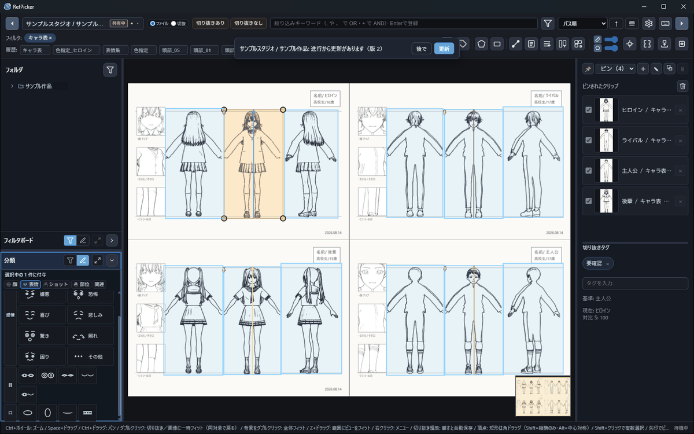

案件の切り替えは画面の左上だけで行います。開いていない案件に更新が来ると、<b>開かなくても ● が付きます</b>。

RefPicker は **プロジェクト単位** で索引と同期を管理します。設定ウィンドウの **「プロジェクト」** セクション、およびメイン画面上部左の **プロジェクト切替** から操作します。

**詳細な同期手順・Google Drive でのテスト・トラブルシュートは [同期ガイド](SYNC_GUIDE.md) を参照してください。** 以下は概要のみです。

**基本概念**

| 用語 | 意味 |
|------|------|
| **プロジェクト** | 索引 DB・サムネ・同期設定のまとまり。切り替えると一覧の対象が変わります |
| **発注元** | プロジェクトの表示ラベル（任意）。`発注元 / 案件名` の形式で表示されます |
| **公式** | 制作進行側が配布する設定資料（ルート・切り抜き・タグ）。同期の対象 |
| **個人** | 受け取り側が自由に追加する参考資料。同期の対象外（プロジェクトごとに分離） |
| **発行元** | 公式データを編集し、パッケージを **公開** する役割 |
| **受け取り** | 公式データを **更新プレビュー → 適用** で取り込む役割。公式の形状変更・削除は不可 |

**複数案件を並行する（受け取り側）**

アニメーターが複数スタジオの案件を同時に進める場合:

1. 案件ごとに **別プロジェクト** を用意します（設定で **新規作成**、または初回 ZIP 取り込みで自動作成）。
2. メイン画面上部左の **プロジェクト切替** で、今見たい案件を選びます。表示は `発注元 / 案件名`（発注元未設定時は案件名のみ）です。
3. 各プロジェクトの同期フォルダを設定すると、**バックグラウンドで更新を監視** します。更新がある案件には **更新** バッジが付きます（開いていない案件も含む）。
4. **今開いていない案件** の更新は、プロジェクト切替メニュー内の **「プレビュー…」** から確認・適用できます（適用前に必ずプレビューと競合解決）。
5. 設定の **「発注元（表示ラベル）」** でスタジオ名などを付けておくと、案件の見分けがしやすくなります。

**発行元（制作進行）の流れ**

1. 設定でプロジェクト名・役割 **発行元** を確認します。
2. **公式ルート** に制作資料フォルダを登録し、切り抜き・タグを整備します。
3. 同期チャネルを選びます:
   - **共有フォルダ**: NAS 等のパスを指定し **「公開」**
   - **手動 ZIP**: **「公開」** またはエクスポートした ZIP を配布
4. 公開前に **「未公開の変更」** 一覧で差分を確認できます。

**受け取り（アニメーター）の流れ**

1. 設定で役割 **受け取り**、対象プロジェクトを選びます。
2. 同期チャネルを発行元と合わせます（共有フォルダパス、または ZIP 手動）。
3. 更新があるとき:
   - **今開いている案件**: 設定の **「更新を確認…」**、またはプロジェクト切替からプレビュー
   - **別の案件**: プロジェクト切替メニューの **「プレビュー…」**
4. プレビューで変更内容を確認し、問題なければ **「更新を適用」**。
5. **個人ルート** に自分の参考フォルダを追加できます（同期されません。プロジェクトごとに別管理）。
6. 公式切り抜きには **タグの追加のみ** 可能です（同期元タグの削除・形状の変更はできません）。
7. 進行側が同期元タグを変更した切り抜きに、手元で追加タグがある場合は **競合** として表示されます。プレビューで「手元の追加タグを破棄して進行側を採用」にチェックを入れてから適用してください（チェックなし＝追加タグを維持）。

**初回取り込み（bootstrap）**

受け取り役割のプロジェクトから、同期チャネルに応じて **「ZIP を選択…」**（手動）または **「同期フォルダを選択…」→「このフォルダから受け取る…」**（共有／クラウド）で取り込みます。**発行元ごとに受け取り用プロジェクトが自動作成**され、そこへ適用されます（編集中の発行元プロジェクトや別案件は上書きされません）。詳細は [同期ガイド](SYNC_GUIDE.md) を参照。

一覧グリッドとフォルダツリーでは、**公式 / 個人** のバッジで出所を区別できます。

**同一 PC での試験**

共有フォルダの代わりにローカルの空フォルダを指定し、発行元で公開 → 受け取りでプレビュー・適用、で動作確認できます。手順の詳細は [同期ガイド](SYNC_GUIDE.md) の「同一 PC」「Google Drive」章を参照してください。

### 1.1 設定でルートフォルダを登録する

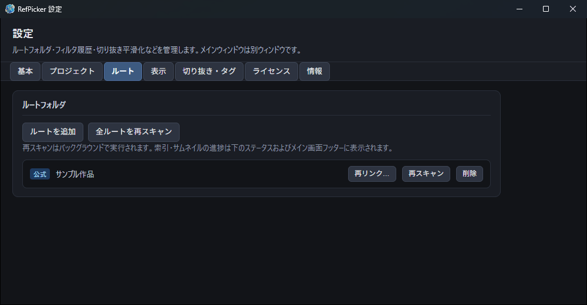

フォルダは<b>移動もコピーもしません</b>。ここに登録した場所を、そのまま索引します。

1. メイン画面右上の **「設定を開く」**（歯車）を押します。
2. 設定ウィンドウの **「ルートフォルダ」** で画像フォルダを追加します。
   - **公式ルートを追加**（発行元・受け取りの公式データ）
   - **個人ルートを追加**（受け取り側の参考資料。同期対象外）
3. ルート登録後、バックグラウンドでスキャンが始まり、進捗は設定ウィンドウ下部やメイン画面のステータスに表示されます。

補足:

- ルートを削除しても **ディスク上のフォルダ/ファイルは削除しません**（索引から外れるだけです）。
- 「全ルートを再スキャン」「再スキャン」は、索引/サムネの同期をやり直す操作です。

### 1.2 フィルタ語を Enter で登録して一覧を出す

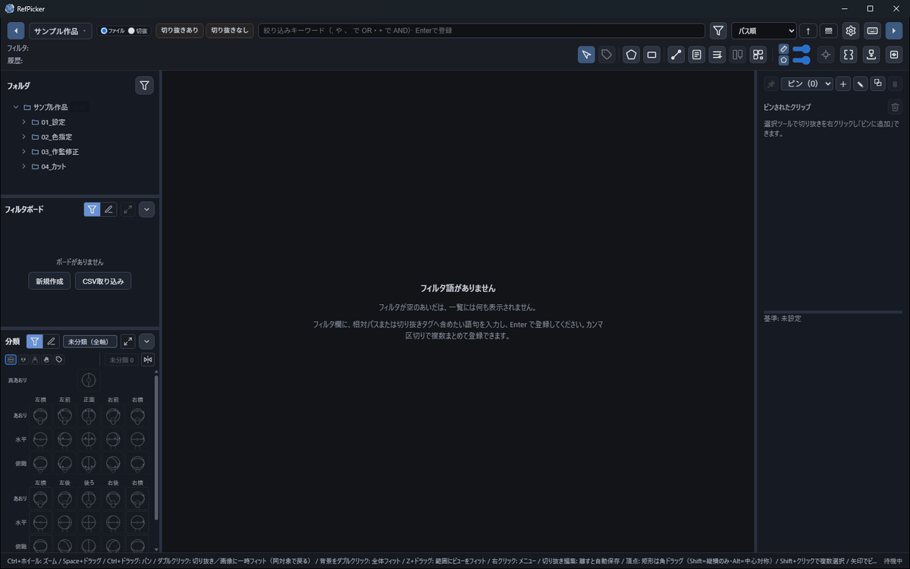

索引ができていても、<b>語を入れるまで一覧は空</b>です。全件を眺める道具ではなく、絞ってから見る道具だからです。

メイン画面上部の入力欄（プレースホルダ: **「絞り込みキーワード（カンマ区切りで複数）· Enterで登録」**）に語句を入力し、**Enter** を押します。

- フィルタ語が **空の間は一覧は表示されません**（仕様です）
- カンマ区切りで複数入力できます（例: `foo, bar`）
- 入力中の文字は **まだ条件に反映されていません**。必ず Enter で登録してください

## 2. 画面構成

### 2.1 メイン画面（`main`）

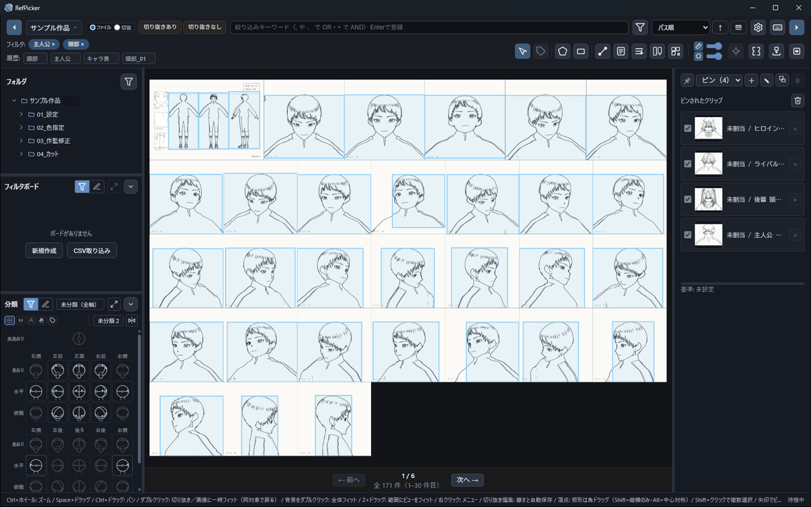

左が「どこにあるか」、中央が「何があるか」、右が「いま手元に置いているもの」です。

- 上部:
  - **プロジェクト切替**（左上）: 案件の切り替え、更新バッジ、非表示案件の **「プレビュー…」**
  - **一覧の表示単位**: `ファイル` / `切抜`
  - **フィルタ入力欄**（Enter で登録）
  - **履歴**（クリックで復元、×で削除）
  - ツールバー（表示単位が `切抜` 以外のとき）:
    - 選択ツール / 多角形ツール / フリーハンドツール / 矩形ツール
    - 切り抜きタグ（選択ツール時・T キー）
    - ズーム（スライダー、Ctrl+ホイール）
    - 全体表示（フィット）
    - メジャー編集 / メジャー管理 / 対比表 / 自動切り抜き（表示単位が `切抜` 以外のとき）
    - 右サイドバー切替
    - （ページング有効かつ 2 ページ以上のとき）中央ペイン下部のページ送り（前へ / 次へ、PageUp / PageDown）
- 中央:
  - 一覧グリッド（ファイル単位または切り抜きBBox単位）
  - ズームでスクロール可能なとき、右下にミニマップ（レイアウト全体の縮図＋黄色枠で現在の表示範囲）。クリックまたはドラッグでその位置へパン
- 右:
  - メジャー・ピン関連のサイドバー（ツールバーから表示切替）

### 2.2 設定ウィンドウ（`settings`）

ヘッダー直下に **4 つのタブ** があります。初回は **ルート** タブが開き、2 回目以降は前回開いていたタブを復元します。操作結果のメッセージはウィンドウ下部のステータス行に表示されます。

| タブ | 内容 |
|------|------|
| **プロジェクト** | プロジェクト選択・新規作成、発注元ラベル、役割、同期チャネル、公開・受け取り（ZIP選択／フォルダから受け取る／更新を確認） |
| **ルート** | ルートフォルダの公式/個人追加・削除・再スキャン（kind バッジ付き）、正解データJSON書き出し（自動切り抜き検証） |
| **表示** | フィルタ履歴の保持件数、**リサイズ時のズーム**、**グラフィックス一覧のページング**、ピンサムネイルのアイコンサイズ |
| **切り抜き・タグ** | フリーハンド平滑化パラメータ、タグプリセット、クリップ正規化のキャンバス余白 |

### 2.3 クリップ正規化ウィンドウ（`normalization_preview`）

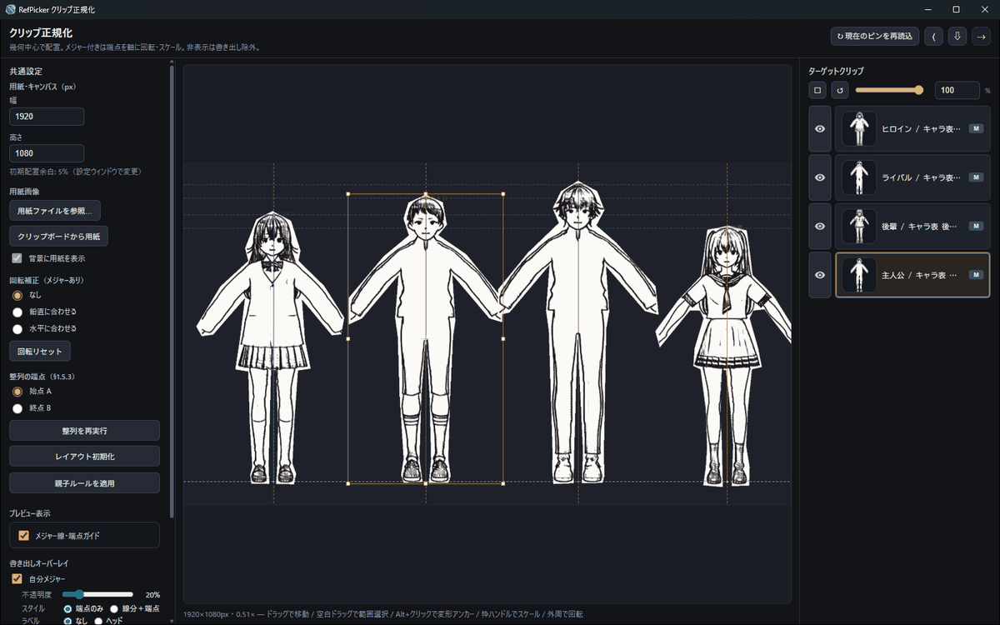

別々の用紙・別々の縮尺で描かれた絵を、メジャーを軸に<b>同じ大きさへ揃えて</b>重ねます。

メイン画面の右サイドバーまたはツールバーから開きます。

- 左ペイン: 用紙・キャンバス、用紙画像、回転補正、整列端点、プレビュー表示
- 中央: キャンバス（ドラッグで移動）
- 右ペイン: ターゲットクリップ（表示/非表示、並び替え、選択の編集、プリセット）

### 2.4 対比表エディタ（`comparison_sheet`）

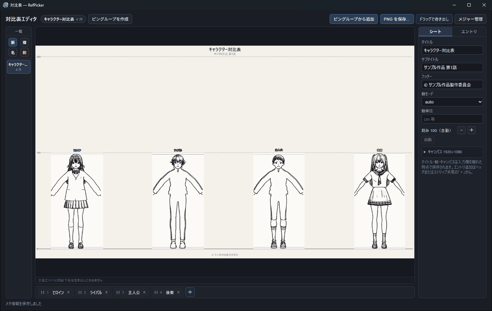

対比表は画像ではなく<b>台帳</b>です。元の設定やメジャーを直せば、次に開いたとき作り直されます。

ツールバーの **対比表**、または右サイドバーのピン操作から開きます。詳細は [9. 対比表](#9-対比表) を参照してください。

- 左: 対比表一覧（新規 / 複製 / 改名 / 削除）
- 右: タイトル・軸・キャンバス設定、プレビュー、エントリ並べ替え、エントリ編集、PNG 書き出し

## 3. 一覧・フィルタ・履歴

### 3.1 表示単位（`ファイル` / `切抜`）

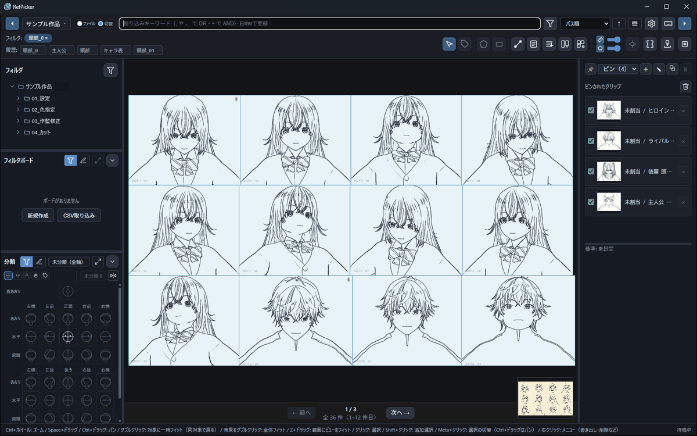

「切抜」にすると、<b>紙ではなく切り抜きが1件</b>として並びます。1ページの件数は設定で変えられます。

- **ファイル**: 画像ファイル単位で一覧します。ここで切り抜きを新規作成します。
- **切抜**: 切り抜きのバウンディングボックス（BBox）単位で一覧します。フィルタ語に一致する切り抜きだけを残す用途に向きます。

注意:

- 切り抜きの新規作成は `**ファイル` 表示で行ってください**（`切抜` 表示では作れません）。

### 3.2 フィルタのマッチ対象

フィルタ語は次に **部分一致**でマッチします。

- 画像の **相対パス**
- 切り抜きに付けた **タグ**

### 3.3 フィルタ履歴

- フィルタを適用すると履歴に保存されます。
- 履歴のボタンを押すと、その条件に戻せます。
- × で履歴から削除できます（保持件数は設定で変更）。

### 3.4 グラフィックス一覧のページング

設定の **「ビュー — グラフィックス一覧」** で **ページングを有効にする** をオンにすると、フィルタ結果を **1 ページあたり N 件**（既定 30、12〜120）に分割して表示します。

- 2 ページ以上あるとき、中央ペイン下部に **前へ / 次へ** とページ番号が表示されます
- **PageUp** / **PageDown** でもページを切り替えられます（入力欄にフォーカスがあるときは無効）
- ページを切り替えると **選択はクリア**され、そのページの内容に **全体フィット**します
- フィルタ変更・表示単位の切替・1 ページあたり件数の変更では **1 ページ目** に戻ります

## 4. 切り抜き

### 4.1 ツールの基本

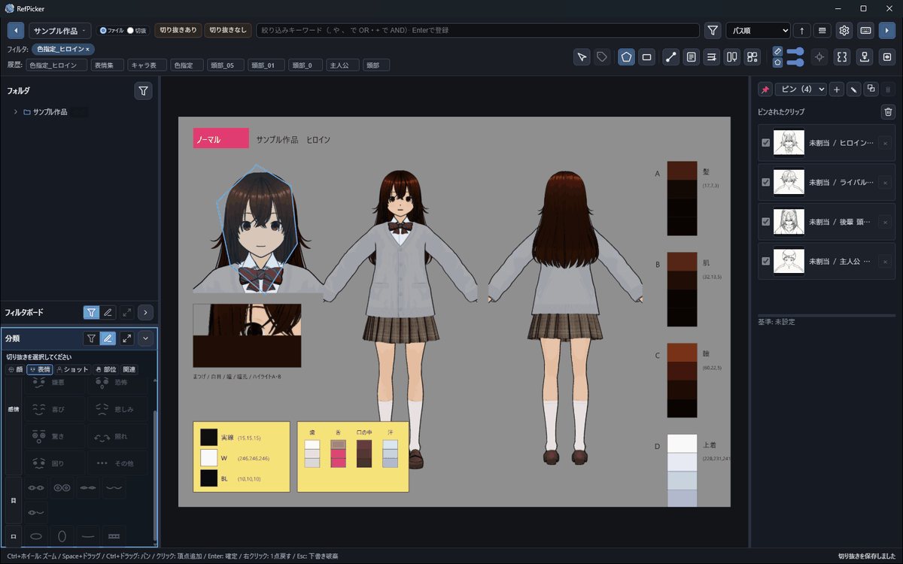

クリックで頂点を置き、Enter で確定します。<b>元の画像には一切書き込みません</b>。

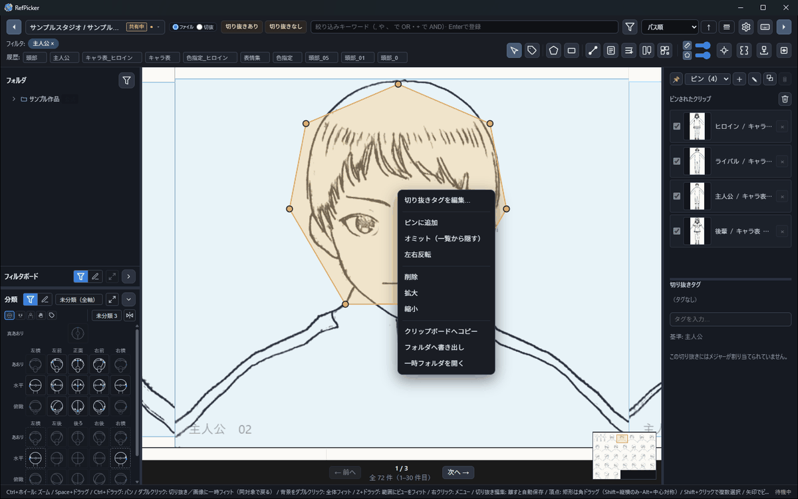

作った切り抜きへの操作は右クリックに集めています。<b>クリップボードへコピーすれば、そのまま作画ソフトに貼れます</b>。

（`ファイル` 表示のとき）

- **選択ツール**:
  - 右クリックでメニュー（書き出し・削除など）
  - 切り抜きは編集して **離すと保存**
  - **Ctrl+Z** で元に戻す
- **多角形ツール**:
  - クリックで頂点追加
  - **Enter** で確定
  - 右クリックで **1点戻す**
- **フリーハンドツール**:
  - ドラッグで描画し、離すと確定
  - 平滑化は設定の「切り抜き — 平滑化」が適用されます
- **矩形ツール**:
  - ドラッグで矩形、離すと確定

**ピンのトグル（`ファイル`／`切抜` どちらの表示でも）:**

- 切り抜きを **中クリック** すると、その切り抜き1件だけピンのオン/オフを切り替えられます（選択状態は変わりません）。`ファイル` 表示ではピン済みの切り抜きに金色のピン印が付きます。
- **P** キーで、選択中の切り抜きのピンをまとめてトグルできます（選択ツール）。
- 右クリックメニューの **ピンに追加** でも同じことができます。

> 主なキーボード・マウス操作は、上部ツールバーの **設定ボタン右隣のキーボードアイコン**（**操作一覧**）からいつでも確認できます。

### 4.2 切り抜きタグ

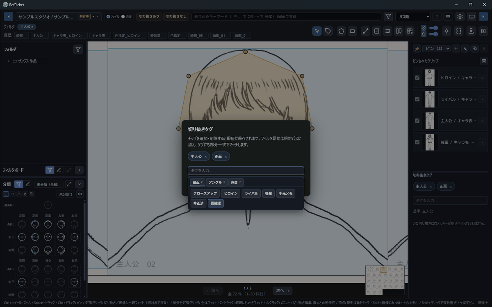

自由に打つタグはここで付けます。<b>候補は既に使った語から出る</b>ので、表記ゆれが増えにくくなっています。

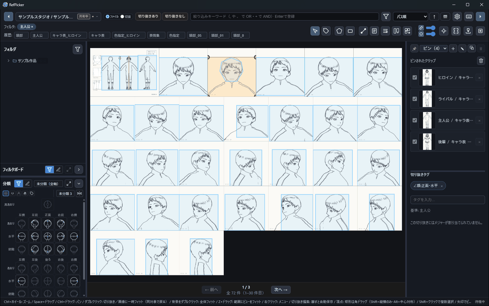

顔の向きは<b>言葉で書かずマスで選びます</b>。「ちょい俯瞰」と「あおり気味」が人によってブレないようにするためです。

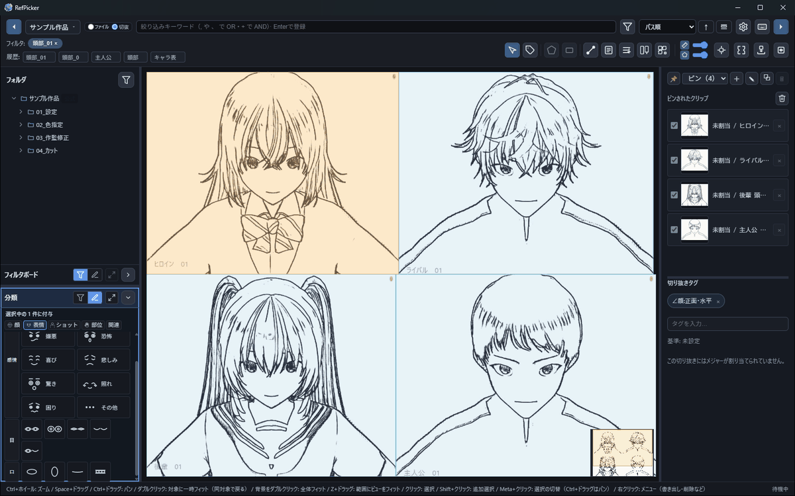

表情は<b>感情・目・口の3つを別々に</b>選びます。軸ごとに排他なので、1つの切り抜きに矛盾する値は入りません。

切り抜きにタグを付けると、フィルタ語のマッチ対象になります（相対パスに加えてタグにも部分一致）。

**開き方（いずれか）:**

- 切り抜き上で右クリック → **「切り抜きタグを編集…」**（複数選択時は件数付き）
- 選択ツール中に **T** キー（入力欄にフォーカスがあるときは無効）
- ツールバーのタグアイコン（選択ツール時）

**編集:**

- チップでタグを追加・削除します。変更は即座に保存されます
- 入力欄では **タブでカテゴリを切り替え**、候補を **チップ** から選べます（最近 → プリセット各カテゴリ → 索引）。←→ でタブ、↑↓ で候補、Enter で追加
- 複数の切り抜きを選んでいるときは、チップは和集合で表示され、追加・削除は選択中の切り抜きすべてに適用されます

**プリセット候補（設定）:**

- 設定ウィンドウの **「切り抜き — タグプリセット」** で、部位・アングル・向きなどの候補語彙を編集できます
- カテゴリごとに **「候補に表示」** を OFF にすると、候補リストからそのカテゴリだけ隠せます（語彙自体は残ります）
- **「デフォルトに戻す」** でアプリ同梱の初期語彙に戻せます

**サイドバー:**

- 右サイドバーのインスペクタでも同じタグ編集 UI が使えます（選択ツールで切り抜きを選んだとき）

### 4.3 自動切り抜きの検出プリセット

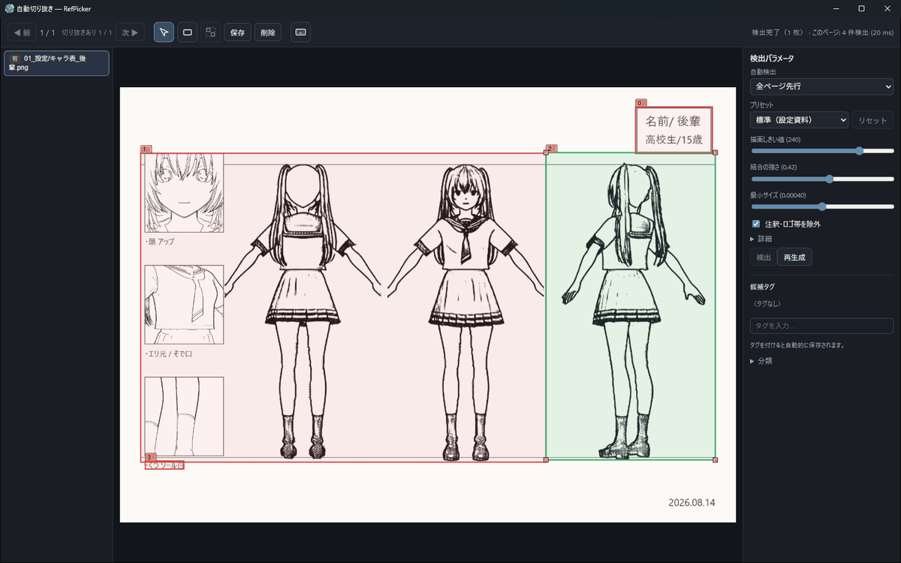

候補は<b>提案</b>です。採否はこちらで選びます。紙の種類でプリセットを変えると当たりが変わります。

自動切り抜きウィンドウの右パネルにある **プリセット** は、**どんな紙を相手にするか** の選択です。
選ぶと検出のしかたごと切り替わります。

| プリセット | 対象 | 主要ノブの先頭 |
|---|---|---|
| **標準（設定資料）** | 白背景の設定資料 | **インクしきい値** — この明るさより暗い画素をインクとみなす |
| **作監修正** | 作監修正集（作画用紙・コピー・デジタル台紙） | **地色との差** — 推定した紙の色からどれだけ離れた画素をインクとみなす |

**「作監修正」を使う目安:** 紙が白ではない（緑の作画用紙・クリーム・デジタルの色付き台紙）、
または標準プリセットで **候補が画像の一番外側の矩形 1 つ** になってしまうとき。
紙の色は 1 枚ごとに自動で推定するので、色の違う紙が混ざったフォルダでもプリセットは 1 つのままで構いません。

このプリセットでは次も自動で行われます。

- **タップ穴を候補から外す**（画像の縁の帯に完全に収まる小さな塊。用紙が横倒しでも効きます）
- **ページを横切る薄い線やスキャンの縁を無視する**（インクの詰まり具合で絵と区別します）

思ったところで切れないときは、**「詳細」** を開いて次を動かします。

- **インク密度の下限** — 上げると薄い線や汚れを強く落とします（下げると細切れになりにくくなります）
- **インク密度の窓** — 広げるほど、線が細く疎な清書系の絵がひと塊にまとまります
- **縁の帯 / 縁マージン** — タップ穴や紙の端が候補に残るときに広げます

なお **注記・吹き出し・「作監修正」のハンコは候補として出ます**。絵と注記を自動で見分けることはしないので、
要らない候補は採用しないでください（採用マークを付けたものだけが切り抜きになります）。

## 5. 書き出し（クリップボード/フォルダ/一時フォルダ）

切り抜き上で右クリックし、メニューから実行します。

- **クリップボードへコピー**:
  - 切り抜き PNG を一時領域に書き出し、Windows ではファイル一覧（CF_HDROP）としてクリップボードへコピーします
  - 他アプリへ貼り付ける用途です
- **フォルダへ書き出し**:
  - 指定したフォルダへ切り抜き PNG をコピーします
- **一時フォルダを開く**:
  - エクスポート用の一時フォルダをエクスプローラーで開きます

## 6. ルートツリーと「探索から除外」

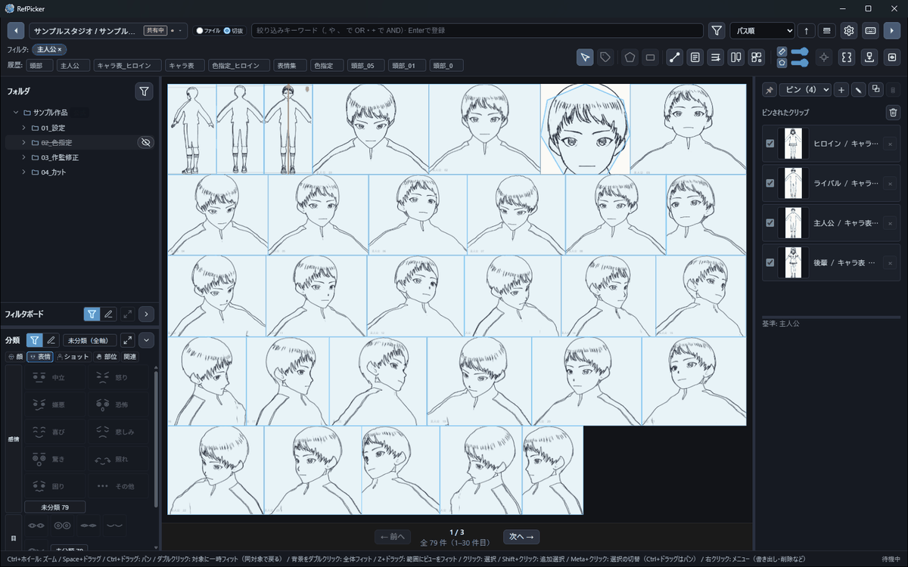

除外は<b>索引から消すのではなく、一覧に出さない</b>設定です。いつでも戻せます。

メイン画面左のルートツリーでは、フォルダ/ファイルを **「探索から除外」** にできます（目のアイコン）。

- 除外したパスは、一覧・フィルタ結果・切り抜き対象から外れます
- ディスク上の削除はしません
- ルート配下のディレクトリを除外すると、**その配下も除外**されます

## 7. プロジェクトの持ち運び（移行）

別PCへ **プロジェクト一式**（公式＋個人ルート・切り抜き・メジャー・除外・**画像同梱**）を移すには、設定「プロジェクト」タブのツールバーから:

1. 移行元PCで **「プロジェクトを書き出し…」** → 単体ZIPに丸ごと書き出す。
2. 移行先PCで **「プロジェクトを読み込み…」** → その移行ZIPを選ぶ。**編集可能な新規プロジェクト**として取り込まれる（購読せず・監視なし・公式データも編集可）。

共有（[同期ガイド](SYNC_GUIDE.md) の 公開／受け取り＝購読・読み取り専用・版更新）とは**別系統**です。継続的に版を揃えたいなら共有、まるごと持っていって続きを編集したいなら移行を使います。

## 8. メジャー・正規化

### 8.1 メジャーの割り当て（メジャーツール）

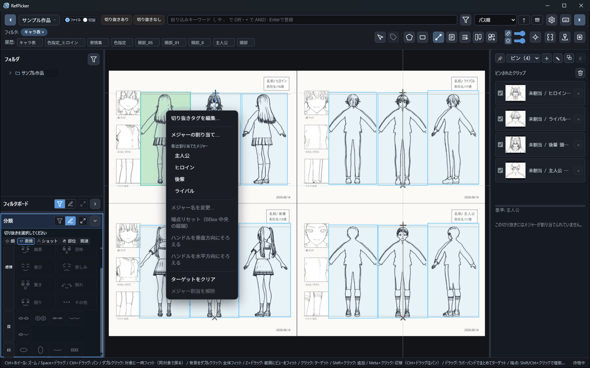

メジャーは「この絵のこの線を、比較の基準にする」という宣言です。<b>1つの切り抜きに1本</b>。

メイン画面でツールを **「メジャー編集」** に切り替え、切り抜き上で右クリックしてメニューから実行します。

- **メジャーの割り当て…**
  - 複数選択にも対応（件数表示あり）
  - 既に割り当てがある場合は端点位置を維持してメジャーだけ差し替えます
  - 未割り当ての場合、端点は **BBox 左右中央の縦線（下端→上端）** に初期配置されます
- **メジャー名を変更…**（単一対象、割り当て済みのみ）
- **端点リセット（BBox 中央の縦線）**
- **ハンドルを垂直方向にそろえる / 水平方向にそろえる**
- **メジャー割当を解除**（割り当て済みのみ）

### 8.2 クリップ正規化ウィンドウ

メイン画面の右パネルから **「クリップ正規化ウィンドウを開く」** を実行すると開きます。

メジャー割当クリップは **対比（基準メジャー比）** で相対サイズが揃ったプレビュー PNG になります。**最終的な出力サイズ**はこのウィンドウのスケール・キャンバス寸法・配置で調整してください（基準メジャーに「目標ピクセル」を設定する必要はありません）。

#### 書き出し

- 右上の **「フォルダへ書き出し…」**（⇩）: 合成した PNG をフォルダへ保存（非表示クリップは除外）
- 右上の **「ドラッグで書き出し」**（⇢）: ドラッグ開始で合成 PNG をまとめてドラッグ（Windows のみ、非表示は除外）

#### よく使う設定

- **用紙・キャンバス（px）**: 書き出し解像度（論理キャンバス）
- **用紙画像**: 編集ビュー用の下絵（プレビュー上のみ。書き出し PNG には含めません）
- **回転補正（メジャーあり）**: なし / 鉛直に合わせる / 水平に合わせる
- **整列の端点**: 始点A / 終点B（メジャー付きの整列や回転・スケールの軸）
- **ターゲットクリップ**: 目のアイコンで表示/非表示（非表示は書き出し除外）

#### 書き出しオーバーレイ（メジャーの焼き込み）

書き出す各レイヤ画像（クリップ1枚＝透明 PNG）に、メジャーの端点・線分・ラベルを**アルファ付きで焼き込み**ます。外部エディタでレイヤを重ねたときの整列ガイドになります。プレビューと同じ見た目で出力されます（WYSIWYG）。左ペインで系統ごとに個別設定できます。

- **自分メジャー**: そのレイヤ自身のクリップのメジャーを描きます（既定 ON・不透明度 20%・端点のみ・ラベルなし）。
- **他メジャー**: 同時に書き出す**他の可視クリップ**のメジャーを、このレイヤ画像へ描きます（既定 ON・不透明度 20%・端点のみ・**ヘッドラベル**＝上端点の右にメジャー名）。
- 各系統で **ON/OFF・不透明度（0–100%）・スタイル（端点のみ／線分＋端点）・ラベル（なし／ヘッド）** を選べます。色はメジャーの色で固定です。
- スプライト本体は従来どおり不透明で焼かれます（オーバーレイ不透明度はスプライトに影響しません）。

### 8.3 メジャー管理ウィンドウ

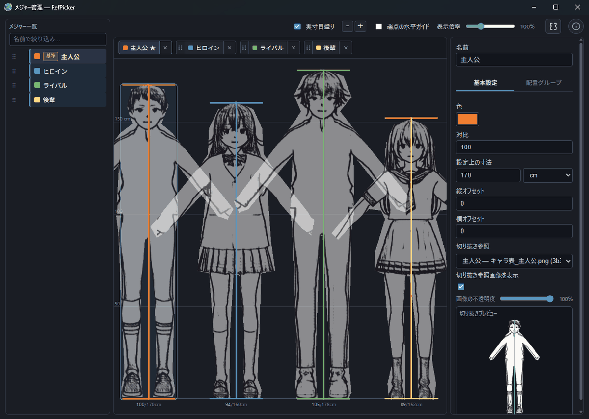

★が基準です。基準を決めてから、ほかのメジャーの対比を見ます。

メイン右パネルまたはメニューから **「メジャー管理ウィンドウを開く」** で、メジャー定義と比較チャートを編集します。

- **対比 S** — 基準メジャーに対する相対スケール（比較チャートの棒の高さ・ドラッグで調整）
- **設定値（補助・任意）** — 折りたたみ内。身長などの数値から対比を算出する補助（任意）
- **基準メジャー** — 一覧・右クリックまたは比較 UI から指定（★ 表示）

> **非推奨:** 以前の「目標ピクセル（P_ref）」入力は廃止しました。DB に残っている値は正規化では使われません。詳細は開発者向け [DEPRECATIONS.md](DEPRECATIONS.md)。

## 9. 対比表

対比表は、メジャー割当済みの切り抜きを **共通の地面（ベースライン）** 上に並べ、左端の目盛り・頭上のキャラ名ラベル・タイトル／権利表記まで焼き込んだ **1 枚の PNG** を作るための台帳です。クリップ正規化（その場で 1 枚に揃える作業）とは別ウィンドウ・別データです。

前提: エントリにする切り抜きには **メジャーが割り当てられている**必要があります。未割当のまま追加しようとすると警告が出ます（**メジャー管理**へ進んでください）。

### 9.1 作成

1. メイン画面で対象の切り抜きにメジャーを割り当てる（[8.1](#81-メジャーの割り当てメジャーツール)）
2. 右サイドバーに切り抜きを **ピン**する（選択ツールで右クリック → **ピンに追加**）
3. ピン一覧の **ピンで対比表を作成**（一覧アイコン＋）を押す
4. 名前を入力すると対比表エディタが開き、ピンした切り抜きがエントリとして入ります

ツールバーの **対比表** からエディタを開き、左の **新規** で空の対比表を作ることもできます（エントリは後からピン経由で追加）。

### 9.2 ピックアップ（フィルタ／ピン）

- **フィルタ語**で一覧を絞り込み、必要な切り抜きだけをピンする運用が基本です
- 既存の対比表へ足すときは、ピンしたうえで **ピンを対比表に追加** を押します（複数ある場合は番号で選択）
- すでに入っている切り抜きの重複追加はスキップされます
- エントリは切り抜きへの **生きた参照**です。元の切り抜きやメジャーを直すと、対比表を開いたときに最新の見た目で再構成されます

### 9.3 並べ替えとエントリ編集

対比表エディタ右側のエントリ一覧で操作します。

- **ドラッグで並べ替え**: 各行左のハンドルをドラッグし、順序を入れ替えます（横並びの順になります）
- **ラベル上書き**: 頭上に出す名前（空なら導出ラベル）
- **数値表示**: 実寸または相対値の副次表示
- **副次ラベル / タグ**: 衣装名など任意の一行
- **縦オフセット / 横微調整**: メジャーが足元まで届かない場合などの補正

参照先の切り抜きが削除されたエントリは **欠落**（⚠）として残り、プレビューではプレースホルダ表示になります。警告一覧から削除できます。

### 9.4 目盛り・ラベル・タイトル

上部の **タイトル / 軸 / キャンバス** パネルで設定します（下書きはプレビューへ即反映。永続化は **メタを保存**）。

| 項目 | 内容 |
|------|------|
| タイトル / サブタイトル / フッター | 焼き込み文言（空なら描かない）。フッターに © 表記などを置けます |
| 軸モード | `auto`（実寸可能なら実寸、そうでなければ相対）/ `realUnit` / `relative` / `hidden` |
| 軸単位・min / max / step | 実寸軸の表示単位と目盛り範囲（空欄は自動） |
| キャンバス幅・高 | 出力 PNG の論理ピクセルサイズ |
| 列間隔比 | エントリ間のすき間 |

基準メジャーはメジャー管理ウィンドウで指定したものを使います（相対軸では 100＝基準）。

### 9.5 書き出し・配布

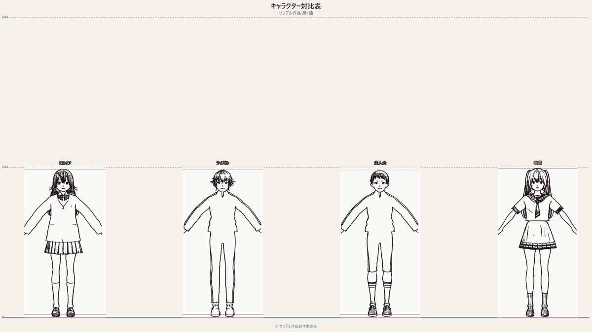

書き出した1枚には<b>目盛りと名前とタイトルが焼き込まれています</b>。そのまま配れます。

プレビュー直上の操作です。

- **PNG を保存…**: 保存ダイアログでパスを選び、目盛り・罫線・ラベル・タイトル込みの単一 PNG を書き出します（既定ファイル名は対比表名）
- **ドラッグで書き出し**: チップをドラッグし、エクスプローラーや他アプリへ PNG を渡します（Windows のみ）

注意:

- **欠落エントリは書き出しに含まれません**。欠落がある場合は確認ダイアログが出ます
- 用紙下絵は対比表にはありません（クリップ正規化の用紙画像とも無関係です）
- 配布物は静止画 PNG です。編集可能な対比表ドキュメント自体の同期配布は対象外です

### ここが押せない場合

| 症状 | 確認 | 解決 |
|------|------|------|
| ピンから対比表を作れない | ピンが空／メジャー未割当 | ピンを追加し、メジャー管理で割り当てる |
| PNG を保存… が無効 | 書き出し可能なエントリが 0 件 | 欠落でないエントリを 1 件以上入れる |
| ドラッグ書き出しが失敗する | OS が Windows 以外 | フォルダ保存（PNG を保存…）を使う |

## 10. データの保存場所（参考）

ネイティブ側の DB・キャッシュ・一時エクスポートは、OS のアプリデータディレクトリ（Tauri `app_data_dir`）配下に保存されます。

- `projects.json`（プロジェクト一覧）
- `projects/<projectId>/crossref.db`（プロジェクトごとの SQLite）
- `projects/<projectId>/thumbs/`（サムネキャッシュ）
- `projects/<projectId>/exports/`（一時エクスポート）

レガシー環境では `crossref.db` がルート直下に残っている場合があります（初回起動時に既定プロジェクトへ移行）。

また、一部のUI状態（ウィンドウ状態・ピン一覧など）は WebView の `localStorage` に保存されます。

対比表の定義（シート名・エントリ順・タイトル等）はプロジェクト DB（`comparison_sheets` / `sheet_entries`）に保存されます。書き出した PNG は指定した保存先、またはドラッグ用の一時フォルダに置かれます。

## 11. よくあるつまずき（トラブルシュート）

### 一覧に何も出ない

- フィルタ語が空だと一覧は表示されません。入力欄に語句を入れて **Enter で登録**してください。
- ルートが未登録の場合は、設定でルートを追加してスキャンが完了するまで待ってください。
- 語句が厳しすぎる場合は、語句を減らす/変える、履歴から別の組み合わせを試してください。

### 「切り抜きの新規作成」ができない

- 表示単位が `切抜` のときは新規作成できません。`ファイル` に切り替えてください。

### クリップボードへコピーしたのに貼り付けできない

- Windows では「ファイルとして貼り付け」扱いです。貼り付け先アプリがファイル貼り付け（CF_HDROP）に対応しているか確認してください。

### 別案件の更新を適用したのに、今見ている一覧が変わった

- 通常、**開いているプロジェクトだけ** 一覧が自動更新されます。別案件への適用はバックグラウンドで完了し、切り替えたときにその案件の内容が表示されます。

### ZIP の適用が「projectId が一致しません」で拒否される

- パッケージは **対応するプロジェクト** にだけ適用できます。別案件用 ZIP を誤って選んでいないか、設定・プロジェクト切替で正しい案件を選んでから再度プレビュー・適用してください。

### 更新バッジが付くが、プレビューが空になる

- 同期フォルダのパスが正しいか、発行元が最新版を公開済みかを確認してください。共有フォルダ・クラウド同期フォルダのチャネル設定が、案件ごとに揃っている必要があります。詳しくは [同期ガイド](SYNC_GUIDE.md) のトラブルシュートを参照してください。