# RefPicker ユーザーガイド

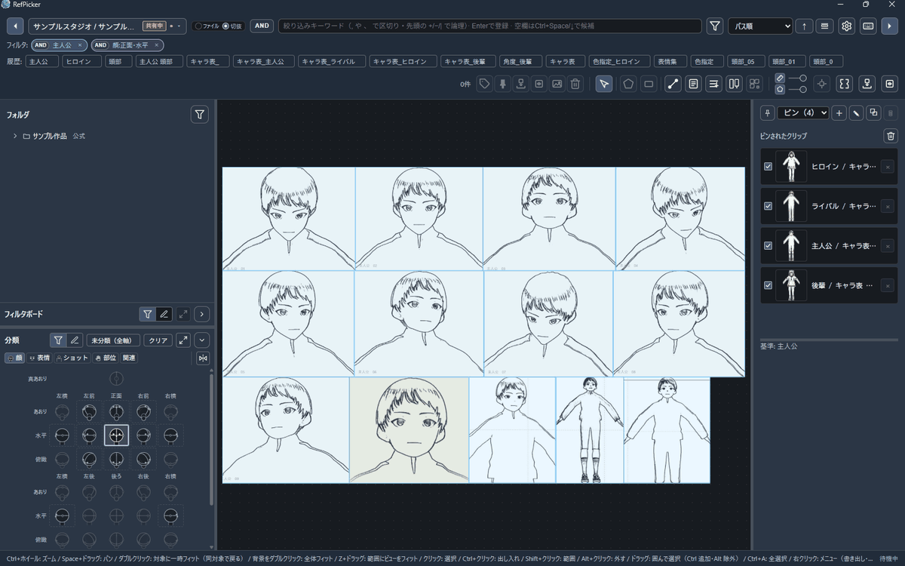

<b>同一キャラの必要な範囲の近いアングルが絞り込まれて並んだ状態</b>

> 画像はすべて、デモ用に生成した**架空の設定資料**で撮影しています。

## 目次

- [対象範囲](#対象範囲)
- [用語](#用語)
- [1. はじめに](#1-はじめに)
  - [1.1 設定でルートフォルダを登録する](#11-設定でルートフォルダを登録する)
  - [1.2 フィルタ語を Enter で登録して絞り込む](#12-フィルタ語を-enter-で登録して絞り込む)
  - [1.3 チームで資料を共有するなら](#13-チームで資料を共有するなら)
- [2. メイン画面と設定](#2-メイン画面と設定)
  - [2.1 メイン画面（`main`）](#21-メイン画面main)
  - [2.2 設定ウィンドウ（`settings`）](#22-設定ウィンドウsettings)
  - [2.3 ライセンス認証](#23-ライセンス認証)
- [3. 一覧・フィルタ・履歴](#3-一覧フィルタ履歴)
  - [3.1 表示単位（`ファイル` / `切抜`）](#31-表示単位ファイル--切抜)
  - [3.2 フィルタのマッチ対象と語の組み合わせ](#32-フィルタのマッチ対象と語の組み合わせ)
  - [3.3 フィルタ履歴](#33-フィルタ履歴)
  - [3.4 一覧のページング](#34-一覧のページング)
  - [3.5 フィルタボード（よく使う条件を置いておけるテーブル）](#35-フィルタボードよく使う条件を置いておけるテーブル)
  - [3.6 1件に寄って見る（一時フィット）](#36-1件に寄って見る一時フィット)
- [4. 切り抜き](#4-切り抜き)
  - [4.1 ツールの基本](#41-ツールの基本)
  - [4.2 切り抜きタグ](#42-切り抜きタグ)
  - [4.3 自動切り抜き](#43-自動切り抜き)
  - [4.4 ピンに集めて並べる（ピン表示）](#44-ピンに集めて並べるピン表示)
- [5. 書き出し（クリップボード/フォルダ/ドラッグ）](#5-書き出しクリップボードフォルダドラッグ)
- [6. 一覧から外す（探索から除外・オミット）](#6-一覧から外す探索から除外オミット)
  - [6.1 探索から除外](#61-探索から除外)
  - [6.2 オミット](#62-オミット)
  - [6.3 オミットビュー](#63-オミットビュー)
- [7. プロジェクトの移行](#7-プロジェクトの移行)
- [8. メジャー・正規化 ＜資料を作る側＞](#8-メジャー正規化-資料を作る側)
  - [8.1 メジャーの割り当て（メジャーツール）](#81-メジャーの割り当てメジャーツール)
  - [8.2 クリップ正規化ウィンドウ](#82-クリップ正規化ウィンドウ)
  - [8.3 メジャー管理ウィンドウ](#83-メジャー管理ウィンドウ)
- [9. 対比表 ＜資料を作る側＞](#9-対比表-資料を作る側)
  - [9.1 作成（対比表エディタ）](#91-作成対比表エディタ)
  - [9.2 ピックアップ（フィルタ／ピン）](#92-ピックアップフィルタピン)
  - [9.3 並べ替えとエントリ編集](#93-並べ替えとエントリ編集)
  - [9.4 目盛り・ラベル・タイトル](#94-目盛りラベルタイトル)
  - [9.5 書き出し・配布](#95-書き出し配布)
  - [ここが押せない場合](#ここが押せない場合)
- [10. データの保存場所](#10-データの保存場所)
- [11. よくあるつまずき（トラブルシュート）](#11-よくあるつまずきトラブルシュート)
  - [一覧に何も出ない](#一覧に何も出ない)
  - [「切り抜きの新規作成」ができない](#切り抜きの新規作成ができない)
  - [クリップボードへコピーしたのに貼り付けできない](#クリップボードへコピーしたのに貼り付けできない)
  - [別のプロジェクトを更新しても、今の一覧は変わりません](#別のプロジェクトを更新しても今の一覧は変わりません)
  - [取り込みが「購読先 (…) が一致しません」で拒否される](#取り込みが購読先--が一致しませんで拒否される)
  - [更新バッジが付くが、更新できない](#更新バッジが付くが更新できない)

## 対象範囲

このドキュメントは全部を読む必要はありません。**立場によって読む範囲が違います。**

| 立場 | 読むところ |
|---|---|
| **資料を見ながら描く**（原画・動画・作画監督） | **§1〜§7**（＋困ったら §11） |
| **資料を受け取る**（チームで配られている） | 上記 ＋ **§1.3** ＋ [同期ガイド](SYNC_GUIDE.md) |
| **資料を作って配る**（設定制作・キャラデザ・総作監） | 上記すべて ＋ **§8・§9** |

**§7 の後に区切りがあります。**そこから先（メジャー・対比表）は**資料を作る側**の作業なので、
受け取って使うだけなら飛ばして構いません。

- 探しているものが見つからないときは [11. よくあるつまずき](#11-よくあるつまずきトラブルシュート) へ。

## 用語

対象OS: Windows。

- **ルート**: 索引対象として登録した画像フォルダ（配下のフォルダを再帰的に探索）
- **フィルタ語**: 上部の「絞り込みキーワード」に Enter で登録した語句（複数可）
- **切り抜き**: 画像上に作った多角形/矩形の領域
- **ピン**: 右サイドバーのピングループに集めておく切り抜きまたは画像（画像のピンは**画像ピン**）。ほしい組み合わせをキープして中央に並べられるほか（[4.4](#44-ピンに集めて並べるピン表示)）、切り抜きのピンは正規化・対比表の材料にもなります
- **メジャー**: 「この絵のこの線を、比べるときの基準にする」という宣言。全身なら頭の先から足先まで、など
- **正規化**: メジャーを軸に、**別々の用紙・別々の縮尺で描かれた絵を同じ大きさへ揃える**こと
- **対比表**: 正規化した切り抜きを1枚に並べ、目盛りと名前を焼き込んだ配布用の PNG（「キャラ対比」の表）
- **配布元（表示ラベル）**: プロジェクトの表示用ラベル（例: スタジオ名）。プロジェクトの境界ではなく、見分けるためのラベルです。配る側の人を指す**共有元**とは別のものです
- **プロジェクト（案件）**: 索引と共有設定の単位。複数を並行して持てます

## 1. はじめに

### 1.1 設定でルートフォルダを登録する

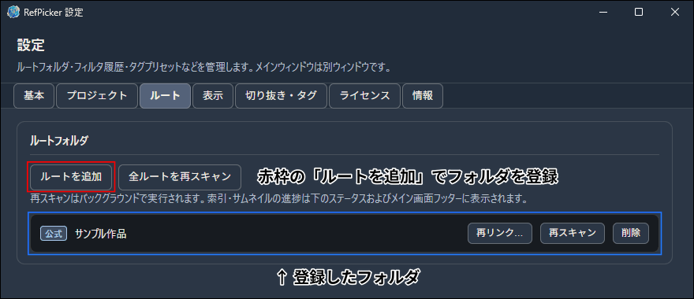

指定したフォルダ自体は<b>移動もコピーもしません</b>。索引用のデータベースとサムネイルだけが作られます。

1. メイン画面右上の **「設定を開く」**（歯車）を押します。
2. 設定ウィンドウの **「ルートフォルダ」** で画像フォルダを追加します。
3. ルートを登録すると、RefPicker がバックグラウンドでスキャンを始めます。進捗は設定ウィンドウ下部とメイン画面のステータスに出ます。

補足:

- ルートを削除しても **ルートフォルダのフォルダ/ファイルには影響はありません**（索引から外れるだけです）。
- 「全ルートを再スキャン」「再スキャン」は、索引/サムネの同期をやり直す操作です。

### 1.2 フィルタ語を Enter で登録して絞り込む

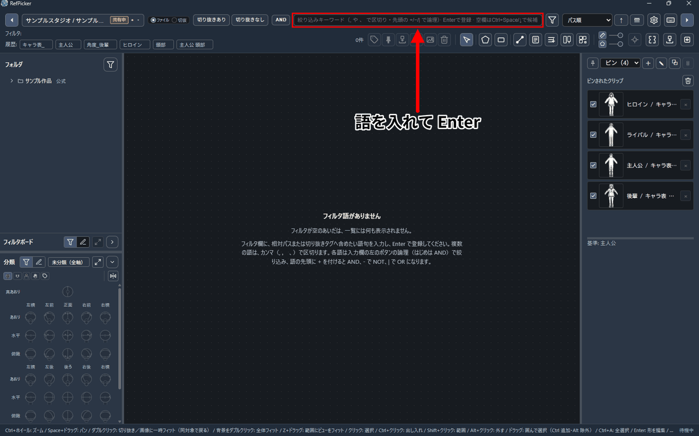

索引ができていても、<b>絞り込み用の文字列を入れるまで一覧は空</b>です。

メイン画面上部の入力欄（プレースホルダ: **「絞り込みキーワード（, や 、 で区切り・先頭の +/−/| で論理）· Enterで登録 · 空欄はCtrl+Space/↓で候補」**）に語句を入力し、**Enter** を押します。

- フィルタ語が **空の間は一覧は表示されません**
- 複数の語は **カンマ（`,` `，` `、`）** で区切ります。はじめは **すべての語に一致するもの（AND）** に絞り込みます（例: `主人公, ヒロイン` → 両方に一致するもの）。OR・NOT の使い方は [3.2](#32-フィルタのマッチ対象と語の組み合わせ) を参照してください。**スペースや中黒では区切られません。**
- 入力中の文字は **まだ条件に反映されていません**。Enter で登録したときに反映されます。
- 入力中の語に一致するタグが、件数付きで候補に出ます。空欄のときは `Ctrl+Space` か `↓` で、よく使うタグの一覧を開けます。

### 1.3 チームで資料を共有するなら

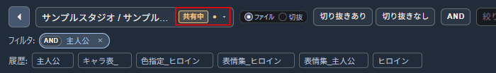

プロジェクトの切り替えは画面の左上だけで行います。開いていないプロジェクトに更新が来ると、<b> ● が付きます</b>。

RefPicker は **プロジェクト単位** で索引と同期を管理します。制作進行が整備した公式設定データを、アニメーターが受け取って使う——という流れを、ローカルのまま（サーバに送らずに）運用できます。

受け取り用のデータを取り込んだプロジェクトが「受け取り」、それ以外が「共有元」として**自動的に識別されます**。

| | 共有元（制作進行・設定制作） | 共有先（原画・動画・作監） |
|---|---|---|
| すること | ルートを登録して整備 → **共有用に設定** → 以後は **共有フォルダに更新を反映** | **共有プロジェクトを読み込み** → 更新が来たら **「更新」** で取り込む |
| ライセンス | **スタジオ用ライセンスが必要** | **ライセンス認証不要** |

受け取った資料（**公式**）の切り抜きの形状や、元から付いているタグは変更・削除できません。タグを足すことと、自分の切り抜きを作ることはできます。共有元から届いた画像の上なら、**分類タグ**（[4.2](#42-切り抜きタグ)）もライセンスなしで付け外しできます。自分で追加したフォルダ（**個人ルート**）は自由に扱えます。

**手順・テスト方法・トラブルシュートは [同期ガイド](SYNC_GUIDE.md) にまとめてあります。**

## 2. メイン画面と設定

### 2.1 メイン画面（`main`）

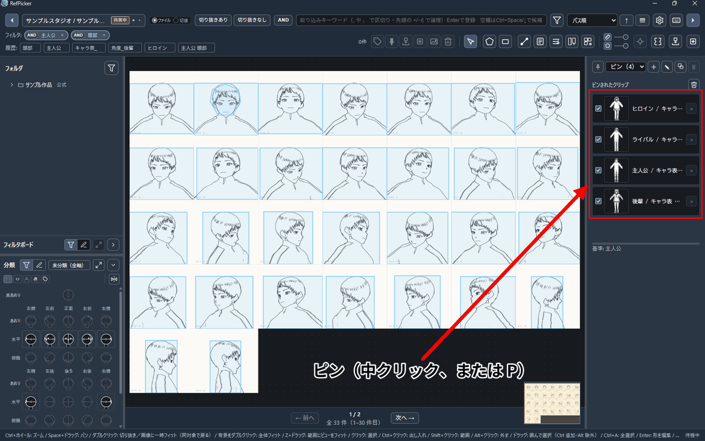

左が「どこにあるか」、中央が「何があるか」、右が「ピンしているもの」です。

- 上部:
  - **プロジェクト切替**（左上）: プロジェクトの切り替え、更新バッジ、開いていないプロジェクトの **「更新」**
  - **一覧の表示単位**: `ファイル` / `切抜`
  - **フィルタ入力欄**（Enter で登録）。左のボタンで、次に入れる語の論理（AND / OR / NOT）を選べます
  - **履歴**（クリックで復元、×で削除）
  - ツールバー:
    - 選択中の切り抜きの操作（選択ツールの左）: 件数・タグ（T キー）・ピン（P キー）・オミット（[6.2](#62-オミット)）・左右反転（H キー）・ドラッグで渡す・削除（Delete キー）。切り抜きを選んでいないと押せません
    - 選択ツール / 多角形ツール / 矩形ツール
    - ズーム（スライダー、Ctrl+ホイール）
    - 全体表示（フィット）
    - メジャー編集 / メジャー管理 / 対比表 / 自動切り抜き
    - 右サイドバー切替
    - （ページング有効かつ 2 ページ以上のとき）中央ペイン下部のページ送り（前へ / 次へ、PageUp / PageDown）
- 中央:
  - 一覧グリッド（ファイル単位または切り抜きBBox単位）
  - ズームでスクロール可能なとき、右下にミニマップ（レイアウト全体の縮図＋黄色枠で現在の表示範囲）。クリックまたはドラッグでその位置へパン
- 右:
  - メジャー・ピン関連のサイドバー（ツールバーから表示切替）

### 2.2 設定ウィンドウ（`settings`）

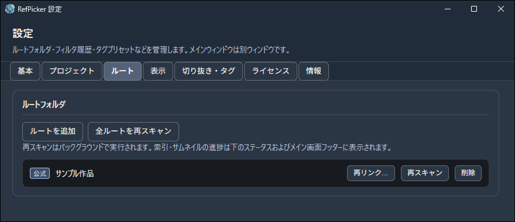

初回は<b>ルート</b>タブが開きます。2 回目以降は前回開いていたタブが開きます。

ヘッダー直下に **7 つのタブ** があります。操作結果のメッセージはウィンドウ下部のステータス行に表示されます。

| タブ | 内容 |
|------|------|
| **基本** | **「データ保存先」**（ライブラリの置き場） |
| **プロジェクト** | プロジェクトの選択・新規作成・変更・削除、配布元（表示ラベル）、**共有**（共有用に設定／共有プロジェクトを読み込み／更新（新版を取り込む）／共有を終了）、**未公開の変更**一覧 |
| **ルート** | ルートフォルダの公式/個人追加・削除・再リンク・再スキャン（🔒 共有元管理バッジ付き） |
| **表示** | **「テーマ」**（**「自動（OS に従う）」**／**「ライト」**／**「ダーク」**）、フィルタ履歴の保持件数、**リサイズ時のズーム**、**グラフィックス一覧のページング**、ピンサムネイルのアイコンサイズ |
| **切り抜き・タグ** | タグプリセット、クリップ正規化のキャンバス余白 |
| **ライセンス** | 認証の状態と「ライセンス認証…」（[2.3](#23-ライセンス認証)） |
| **情報** | バージョン・ビルド時刻・著作権 |

> **プロジェクトのタイプ（共有元/共有先）はデータから自動的に判定されます**（[1.3](#13-チームで資料を共有するなら) / [同期ガイド](SYNC_GUIDE.md)）。

### 2.3 ライセンス認証

ライセンスキーは設定ウィンドウから入れます。

1. 設定の **ライセンス** タブで **「ライセンス認証…」** を押します。
2. 開いた画面にキーを入れ、**「認証する」** を押します。
3. 認証できると **「認証に成功しました。」** と表示され、タブの「現在:」の行が **「個人ライセンス（認証済み）」** または **「スタジオ用ライセンス（認証済み）」** に変わります。

認証したあとは、同じ画面で次の操作ができます。

- **「別のキーに置き換える…」**: 別のキーに入れ替えます
- **「解除」**: この PC での認証を外します
- **「再検証」**: 認証の状態を確かめ直します
- **「サブスク・請求の管理（カスタマーポータル）」**: 購読の管理ページを開きます

認証の状態はデータ保存先に含まれません。別の PC では、その PC で認証してください（[10](#10-データの保存場所)）。

## 3. 一覧・フィルタ・履歴

### 3.1 表示単位（`ファイル` / `切抜`）

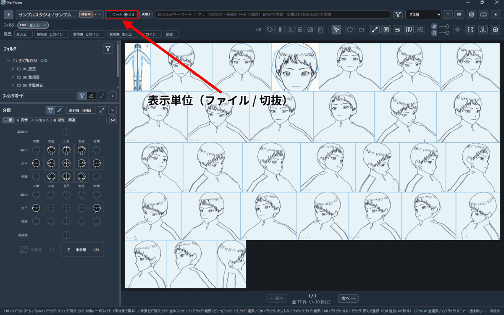

「切抜」にすると、<b>画像ではなく切り抜きが1件</b>として並びます。1ページの件数は設定で変えられます。

- **ファイル**: 画像ファイル単位で一覧します。ここで切り抜きを新規作成します。
- **切抜**: 切り抜きのバウンディングボックス（BBox）単位で一覧します。フィルタ語に一致する切り抜きだけを残す用途に向きます。

注意:

- 切り抜きの新規作成は `ファイル` 表示でのみ行えます（`切抜` 表示では作れません）。

### 3.2 フィルタのマッチ対象と語の組み合わせ

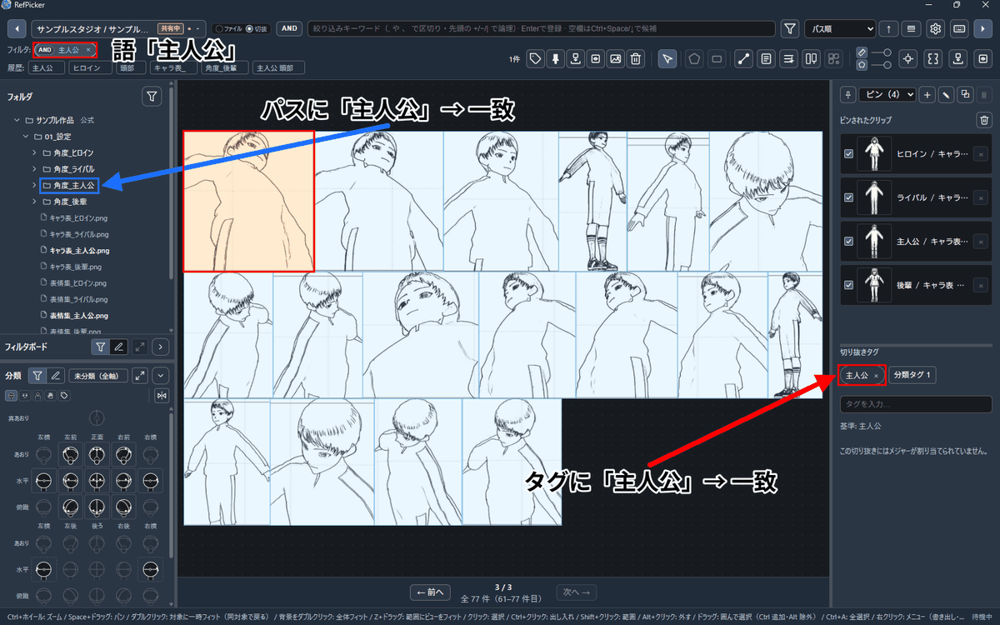

1つの語が、<b>パスとタグのどちらに一致しても</b>一覧に出ます。

フィルタ語は次に **部分一致**でマッチします。

- 画像の **相対パス**
- 切り抜きに付けた **タグ**

**語の組み合わせ:**

- 複数の語は **カンマ（`,` `，` `、`）** で区切ります。語ごとに **AND**（すべての語に一致）／**OR**（どれかの語に一致）／**NOT**（除外）を持ちます。
- はじめは **AND** です。入力欄の左のボタンを押すと、次に入れる語の既定が AND → OR → NOT と切り替わります。
- 語の先頭に `+` を付けると AND、`-` で NOT、`|` で OR になります（その語だけ）
- 登録した語の論理は、チップ左端の印を押すと切り替わります
- `+` は語の区切りではありません。`主人公+頭部` は `主人公` と `+頭部` の 2 語です。

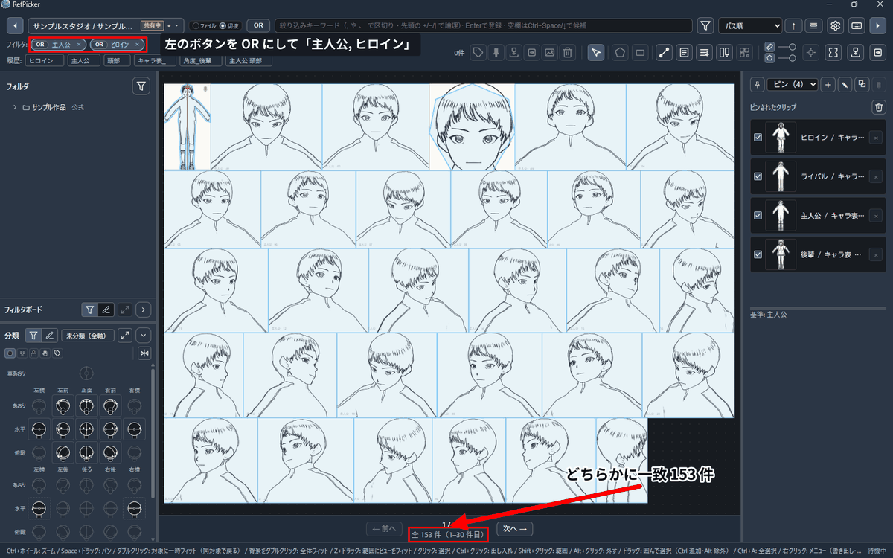

OR の語は、<b>どれかに一致する</b>ものが並びます。

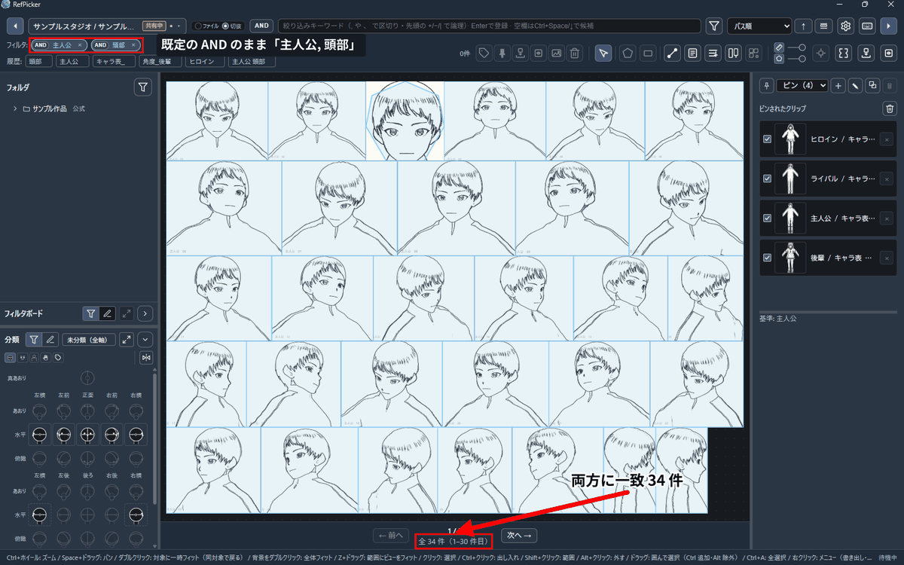

AND の語は、<b>すべてに一致する</b>ものだけに絞れます。

**日時で絞る:**

入力欄の横のボタン（**「フィルタを追加（日時など）」**）から、**「追加が最近」**（このプロジェクトに画像が入った日時）と **「更新が最近」**（画像ファイルの更新日時）を、今日・3日・7日・30日から選べます。フィルタ語と AND で効き、履歴には残りません。

### 3.3 フィルタ履歴

- フィルタを適用すると履歴に保存されます。
- 履歴のボタンを押すと、その条件に戻せます。
- × で履歴から削除できます（保持件数は設定で変更）。

### 3.4 一覧のページング
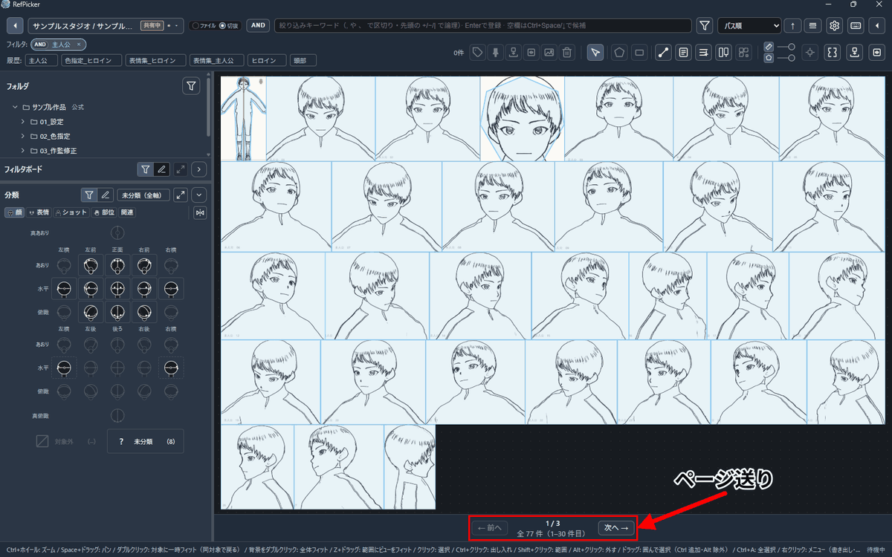

件数が多いときは<b>ページで区切って</b>表示できます。

設定の **「ビュー — グラフィックス一覧」** で **ページングを有効にする** がオンだと、RefPicker がフィルタ結果を **1 ページあたり N 件**（既定 30、12〜120）に分けて表示します。

- 2 ページ以上あるとき、中央ペイン下部に **前へ / 次へ** とページ番号が表示されます
- **PageUp** / **PageDown** でもページを切り替えられます（入力欄にフォーカスがあるときは無効）
- ページを切り替えると **選択はクリア**され、そのページの内容に **全体フィット**します
- フィルタ変更・表示単位の切替・1 ページあたり件数の変更では **1 ページ目** に戻ります

### 3.5 フィルタボード（よく使う条件を置いておけるテーブル）

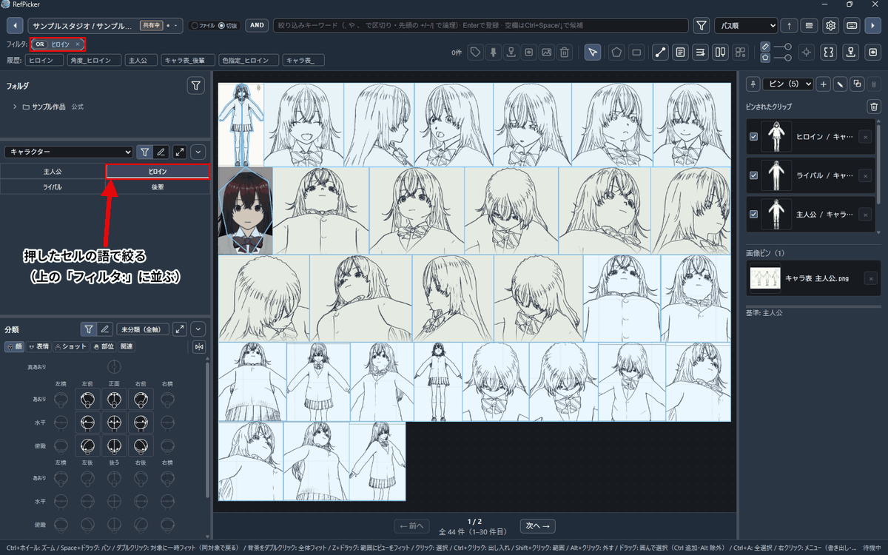

押したセルの語が<b>「フィルタ:」の行にチップで入ります</b>。チップを外すと、セルの押された表示も消えます。

**作業のあいだ何度も使う絞り込み条件**は、履歴のように流れていかない場所へ固定できます。

左ペインの **フォルダツリーと「分類」の間** にある格子が **フィルタボード** です。**既定では閉じている**ので、見出しの `∨` で開いてください。

**ボードを作る・切り替える:**

- ボードが1枚も無いときは、開いたペインの **「新規作成」**（空のボード）か **「CSV取り込み」**（表から作る）を押します
- 2枚目からは、見出しの **「モーダルで編集」** で編集画面を開き、左の一覧の **「新規」**・**「取り込み」**・**「複製」**・**「改名」**・**「書き出し」**・**「削除」** を使います
- ボードが複数あるときは、見出しの選択欄（**「フィルタボードを切り替える」**）で切り替えます
- 見出しの2つのボタンで、セルに文字を入れる **「編集モード」** と、セルを押して絞り込む **「ボタンモード（絞り込み）」** を切り替えます

**押して絞り込む:**

- セルには**フィルタ語句になる文字列**を自分で並べます
- **クリック** = そのセルの語句だけに切り替え／**Ctrl+クリック** = OR で足す／**Shift+クリック**・**右クリック** = AND で足す／**Alt+クリック**・**中クリック** = NOT で足す（同じ論理で入っていれば外す）
- **上端・左端の見出し帯**を押すと、その行／列のマスをまとめて適用します
- セルには**色**を付けられます（赤・橙・黄・緑・青・紫）

**1つのセルに複数の条件を書く:**

- `A、B` — 区切った語は、押し方の論理になります（クリック・Ctrl+クリックなら **OR**＝どちらかに部分一致、Shift+クリックなら AND、Alt+クリックなら NOT）
- `A+B` — **AND**（両方に部分一致）
- 語の先頭の `-`（NOT）・`|`（OR）も、入力欄と同じように使えます（[3.2](#32-フィルタのマッチ対象と語の組み合わせ)）

**表から取り込む:**

- **「CSV取り込み」** か一覧の **「取り込み」** から、Excel などで作った表（CSV・TSV・テキスト）をファイル選択または**貼り付け**で取り込めます（Excel 由来の Shift_JIS も読めます）。取り込んだ表は新しいボードになります
- ペインに**ファイルをドロップ**しても取り込めます
- 作ったボードは一覧の **「書き出し」** で **`.refboard`** に書き出せます。別の PC では、同じ **「取り込み」**（ボードが無いときは **「CSV取り込み」**）でそのファイルを選ぶと、同じボードが新しく作られます。

> **ボードは1枚まで無料です。** 編集・保存・削除・切り替えはずっと無料のまま、**2枚目を作る・取り込む・複製する**ときだけライセンス認証が要ります（案内が出ます）。

### 3.6 1件に寄って見る（一時フィット）

一覧の切り抜きや画像を **ダブルクリック** すると、その1件が中央のペインいっぱいに表示されます（**一時フィット**）。同じものをもう一度ダブルクリックすると、寄る前の表示に戻ります。

- 寄っている間は **←** / **→** で、前後の切り抜き（画像に寄っているときは前後の画像）へ寄り直します。ページの端では次（前）のページへ進みます
- 寄った1件は選択された状態になるので、そのままタグを付けたりピンしたりできます
- 背景（切り抜きも画像も無いところ）をダブルクリックすると、全体表示に戻ります

## 4. 切り抜き

### 4.1 ツールの基本

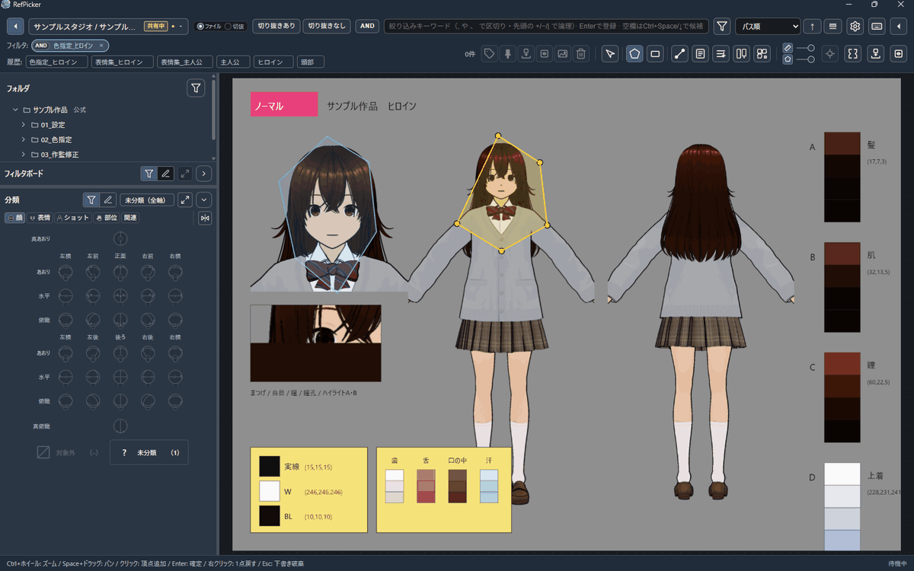

クリックで頂点を置き、Enter で確定します。<b>元の画像には一切書き込みません</b>。

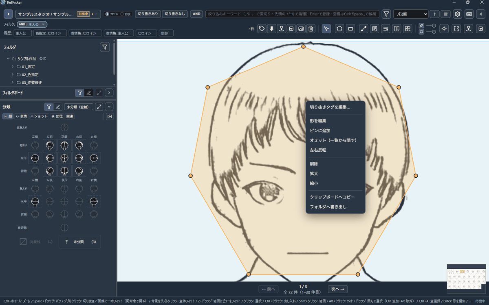

作った切り抜きへの操作は、右クリックのメニューとツールバーから行います。<b>クリップボードへコピーすれば、そのまま作画ソフトに貼れます</b>。

（`ファイル` 表示のとき）

- **選択ツール**:
  - クリックで選択します。`Shift`＋クリックで範囲、`Ctrl`＋クリックで出し入れ、ドラッグで囲んで選択（切り抜きの上からも囲めます）。表示の移動は `Space`＋ドラッグです。
  - 右クリックでメニュー（書き出し・削除など）
  - 形を直すときは、切り抜きを1つ選んで `Enter` か、右クリックの **「形を編集」** を使います。編集中は多角形の内側をドラッグで移動でき、**離すと保存**します。
  - **Ctrl+Z** で元に戻す
  - 選んだ切り抜きへの操作（タグ・ピン・オミット・左右反転・ドラッグで渡す・削除）は、ツールバーの選択ツールの左にまとまっています
- **多角形ツール**:
  - クリックで頂点追加
  - **Enter** で確定
  - 右クリックで **1点戻す**
- **矩形ツール**:
  - ドラッグで矩形、離すと確定

**ピンのトグル（`ファイル`／`切抜` どちらの表示でも）:**

- 切り抜きを **中クリック（マウスホイールのクリック）** すると、その切り抜き1件だけピンのオン/オフを切り替えられます。`ファイル` 表示ではピン済みの切り抜きに金色のピン印が付きます。
- **P** キーで、選択中の切り抜きのピンをまとめてトグルできます（選択ツール）。
- 右クリックメニューの **ピンに追加** でも同じことができます。
- 画像のピンと、ピンしたものだけを並べる表示は [4.4](#44-ピンに集めて並べるピン表示) を参照してください。

**左右反転（表示だけ）:**

- 選んだ切り抜きは **H** キーか、ツールバーの **「左右反転（H）」** で左右反転して表示します
- 一覧全体は、ツールバーの **「ビュー全体を左右反転（表示のみ）」**（**Shift+H**）で反転します
- 反転するのは表示だけです。切り抜きの形・メジャー・書き出す PNG は元の向きのままです。選んだものの反転は、フィルタを変えたときや RefPicker を起動し直したときに元に戻ります

> 主なキーボード・マウス操作は、上部ツールバーの **設定ボタン右隣のキーボードアイコン**（**操作一覧**）からいつでも確認できます。

### 4.2 切り抜きタグ

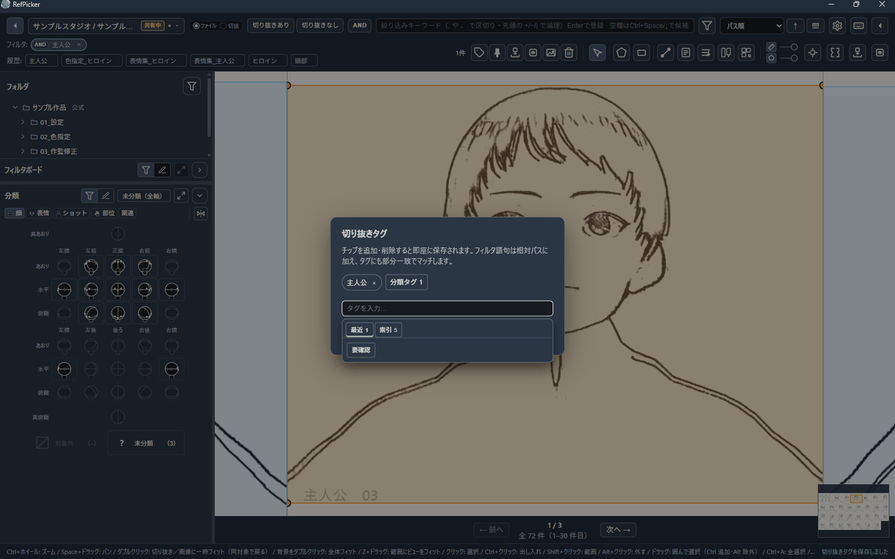

自由タグはここで付けます。<b>候補は既に使った語から出る</b>ので、表記ゆれが増えにくくなっています。

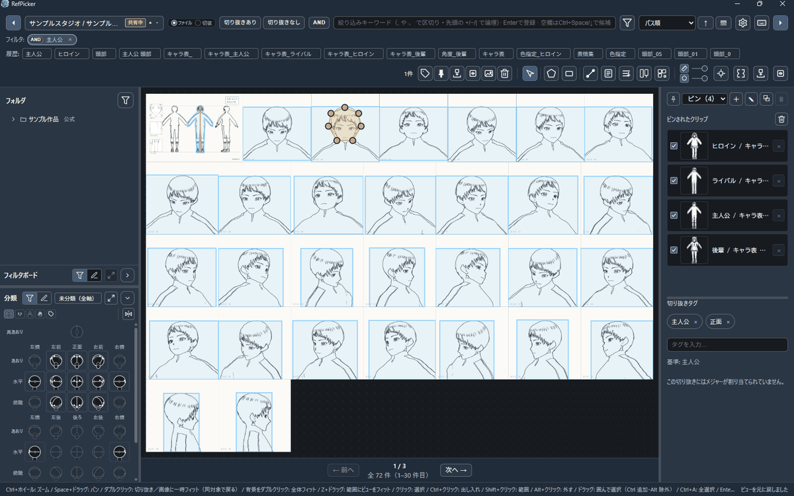

顔の向きは<b>あらかじめ用意された一覧から選択できます。

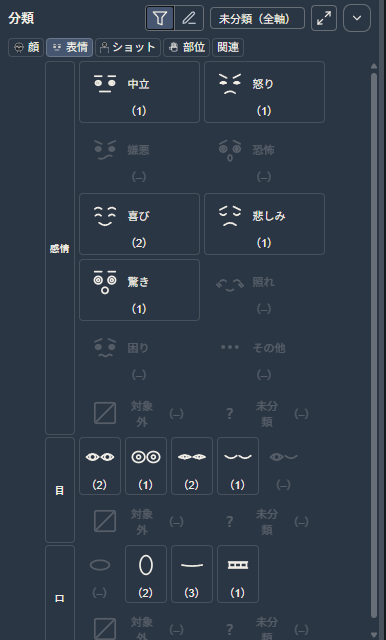

表情は<b>感情・目・口の3つを別々に</b>選びます。軸ごとに排他なので、1つの切り抜きに矛盾する値は入りません。

切り抜きにタグを付けると、フィルタ語のマッチ対象になります（相対パスに加えてタグにも部分一致）。

タグには**2種類**あります。

| | **分類タグ** | **自由タグ** |
|---|---|---|
| 付け方 | 左ペインの **「分類」** から、**既定で用意された値を選択して**付ける | タグ編集の入力欄に**自由に**入力 |
| 語彙 | アプリで事前に登録された**閉じた語彙**（手入力はできません） | 自由。使った語が候補として入力補完されます |
| 目的 | 汎用的な分類を迷いなく行う | 現場・個人ごとに柔軟に管理する |
| ライセンス | **編集に認証が要ります**（受け取ったプロジェクトで、共有元から届いた画像の上なら不要） | **ライセンス認証不要** |

> **絞り込み**の機能にライセンスによる制限はありません。

**「分類」ペインの使い方:**

- タブは **顔 / 表情 / ショット / 部位 / 関連** の5枚です
- **顔・ショット・部位・表情** は分類の軸です。ボタンを押して付けます
- **関連** タブは、**いま絞り込まれている切り抜きに付けられた自由タグ**を件数付きで並べます。
  選択してさらに絞りこむことができます
- **関連** タブの **「グループ編集」** で、自由タグを見出しごとにまとめて並べられます（タググループ）。グループに置いた語は、まだ付いていなくても常に表示されます。受け取ったプロジェクトでは編集できません。
- ペインには **付与モード**（タグを付ける）と **絞り込みモード**（タグで引く）があります
- 絞り込みモードでは、クリックで AND、右クリックで置き換え、`Ctrl`＋クリックで OR、`Alt`＋クリックか中クリックで NOT を足します。選んだ値は **「フィルタ:」** の行にチップで並びます。
- 件数は、いまのフィルタ全体で数えます。足すと 0 件になる値は破線の枠、どう押しても 0 件になる値は薄く表示されます。
- **未分類** を選ぶと、その軸のタグが1つも付いていない切り抜きだけを表示することができます
- 各軸の値の下に **「対象外」** と **「未分類」** が並びます。顔の写っていない切り抜きなどに対象外を付けると、未分類に出なくなります。
- 絞り込みモードの **「未分類（全軸）」** は、すべての軸の未分類をまとめて選びます。付け忘れを探すときは、表示単位を `切抜` にして使います
- 絞り込みモードの顔タブで **「左右反転を含める」** を押しておくと、選んだ顔の向きと左右が逆の向きも一緒に出ます

**自由タグの使い方:**

- 切り抜き上で右クリック → **「切り抜きタグを編集…」**（複数選択時は件数付き）
- 選択ツール中に **T** キー（入力欄にフォーカスがあるときは無効）
- ツールバーの選択中の切り抜きの操作にある、タグのボタン（選択ツール時）

**編集:**

- チップでタグを追加・削除します。変更は即座に保存されます
- 入力欄では **タブでカテゴリを切り替え**、候補を **チップ** から選べます（最近 → プリセット各カテゴリ → 索引）。←→ でタブ、↑↓ で候補、Enter で追加
- 複数の切り抜きを選んでいるときは、チップは和集合で表示され、追加・削除は選択中の切り抜きすべてに適用されます

**プリセット候補（設定）:**

- 設定ウィンドウの **「切り抜き — タグプリセット」** で、タグの候補語彙を編集できます
- カテゴリごとに **「候補に表示」** を OFF にすると、候補リストからそのカテゴリだけ隠せます（語彙自体は残ります）
- **「すべて削除…」** で、編集した候補語彙をまとめて消せます（**アプリは語彙を同梱していません**。消したあとは空の状態に戻り、また使った語から候補が育ちます）

**サイドバー:**

- 右サイドバーのインスペクタでも同じタグ編集 UI が使えます（選択ツールで切り抜きを選んだとき）

**連続付与（1件ずつ送りながら分類タグを付ける）:**

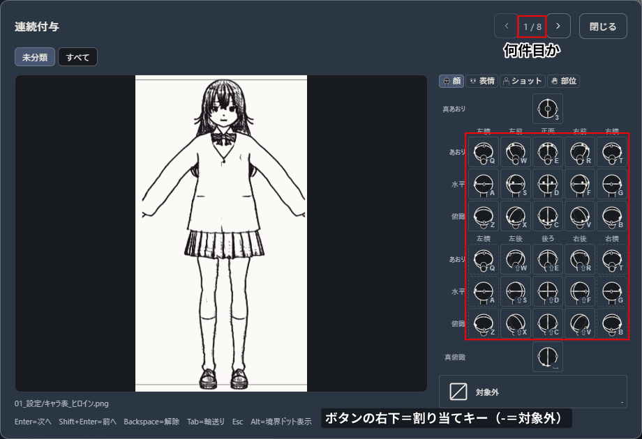

ボタンの右下の文字が、<b>そのボタンを押すキー</b>です。

- 「分類」ペインの見出しのボタン（**「モーダルで連続付与」**）で開きます。開いたときのフィルタ結果の**全件**が対象です
- タブは顔・表情・ショット・部位で、`Tab` で切り替えます
- 値はクリックか、ボタンの右下に出ているキーで付けます。顔とショットは、付けると次の切り抜きへ進みます。部位は複数付けられるので、`Enter` で次へ送ります。表情タブは、最後の口を付けたときに進みます
- `-` で対象外を付け、`Backspace` でそのタブの値を外します。`←` / `→`（またはホイール）で前後へ移ります
- 上の **「未分類」** / **「すべて」** で、まだ付いていないものだけを回るか、全件を回るかを選べます（はじめは **「未分類」**）
- 付けるのは分類タグなので、ライセンスの扱いは上の表と同じです

### 4.3 自動切り抜き

> 設定等の1 枚の画像から複数の切り抜きをまとめて起こす機能です。**資料を作る側**で使うことが多く、配られた資料を見て描く立場の場合この項目は飛ばして構いません。

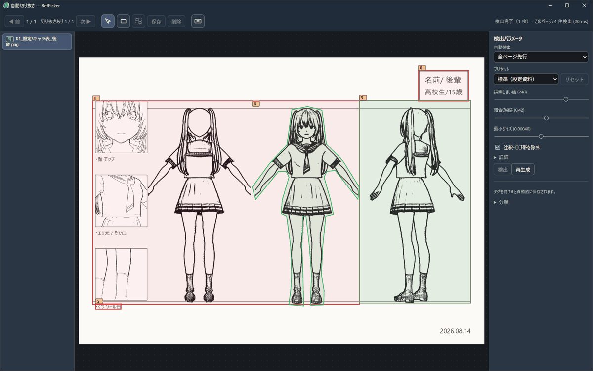

候補の段階では<b>切り抜きとして確定されていません</b>。候補を切り抜きとして採用するかどうかを選びます。画像の種類（現在は「設定」または「作監修正」）でプリセットを変えると、検出される候補が変わります。

**使い方:**

1. メイン画面で、処理したい画像が一覧に出るように絞り込みます（表示単位は `ファイル`）。
2. ツールバーの自動切り抜きのボタン（`Alt+A`）を押すと、**「自動切り抜きで処理」** の確認が出ます。フィルタ結果の画像（ピン表示中はピンした画像）が送られます。**「切り抜きが無い画像だけ」** にチェックすると、まだ切り抜きの無い画像に絞れます。確認が要らないときは、確認を出さずに送ります。
3. 自動切り抜きウィンドウで、`PageUp` / `PageDown`（またはホイール）で画像を送りながら候補を確かめます。候補は開いたページから自動で検出されます（右パネルの **「自動検出」** で、全ページを先に検出するか、手動で検出するかも選べます）。
4. 残したい候補を選んで **「保存」**（`A` キー、または候補のダブルクリック）を押すと、その場で切り抜きとして保存されます。
5. 足りない範囲は、矩形追加（`2`）で画像の上をドラッグして描きます。描いた矩形はそのまま保存されます。1つの絵が細かく割れたときは、候補を2つ以上選んで結合のボタンで1つの矩形にまとめます。

ウィンドウを閉じると、送った画像の並びと保存していない候補は消えます（保存した切り抜きは残ります）。

自動切り抜きウィンドウの右パネルにある **プリセット** は、**どんなタイプの画像を対象にするか** の選択です。
選ぶと検出方法が切り替わります。

| プリセット | 対象 | 主要ノブの先頭 |
|---|---|---|
| **標準（設定資料）** | 白背景の設定資料 | **「描画しきい値」** — この明るさより暗い画素を描画とみなす |
| **作監修正** | 作監修正集（作画用紙・コピー・デジタル台紙） | **地色との差** — 推定した紙の色からどれだけ離れた画素を描画とみなす |

**「作監修正」を使う目安**は、次のどちらかに当てはまるときです。

- **紙が白ではない** — 緑の作画用紙、クリーム、デジタルの色付き台紙など

- 標準プリセットで **候補が画像の一番外側の矩形 1 つ**になってしまう
紙の色は 1 枚ごとに自動で推定するので、色の違う紙が混ざったフォルダでもプリセットは 1 つのままで構いません。

このプリセットでは次も自動で行われます。

- **タップ穴を候補から外す**（画像の縁の帯に完全に収まる小さな塊。用紙が横倒しでも効きます）
- **ページを横切る薄い線やスキャンの縁を無視する**（描画の詰まり具合で絵と区別します）

思ったところで切れないときは、**「詳細」** を開いて次を動かします。

- **「描画密度の下限」** — 上げると薄い線や汚れを強く落とします（下げると細切れになりにくくなります）
- **「描画密度の範囲」** — 広げるほど、線が細く疎な清書系の絵がひと塊にまとまります
- **縁の帯 / 縁マージン** — タップ穴や紙の端が候補に残るときに広げます

なお **注記・吹き出し・「作監修正」の印などは候補として出ます**。絵と注記を自動で判別するのは困難なので、
要らない候補は切り抜きとして採用しないでください（**「保存」** した候補だけが切り抜きになります）。

### 4.4 ピンに集めて並べる（ピン表示）

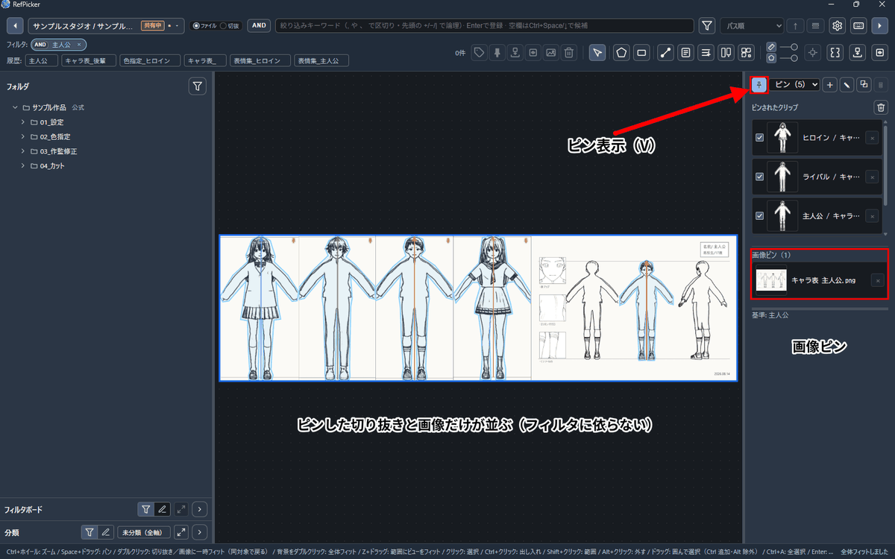

中央には<b>ピンしたものだけ</b>が、ピングループの順に並びます。

**ピンする:**

- 切り抜き: **中クリック**、選んで **P** キー、または右クリックの **ピンに追加**（[4.1](#41-ツールの基本)）
- 画像: 画像の上で **中クリック**、または右クリックの **「画像をピン」**（**画像ピン**）

**ピングループ:**

ピンは右サイドバーの**ピングループ**に入ります。目的ごとにグループを分けておき、選択欄（**「アクティブなピングループを切り替える」**）で切り替えます。横のボタンで新規作成・名前の変更・複製・削除ができます。ピンが入るのは、選択欄で選んでいるグループです。

**ピン表示:**

右サイドバーの **「ピン表示」** のボタン（または **V** キー）を押すと、中央の一覧が、選んでいるピングループの中身だけに切り替わります。

- この間は、フィルタ語・表示単位・オミット（[6.2](#62-オミット)）に関係なく、ピンしたものがすべて並びます
- 画像ピンの上でも、矩形・多角形ツールで切り抜きを作れます。選択・形の編集・タグ・メジャーも通常の一覧と同じです
- もう一度押すと通常の一覧に戻ります。フィルタ語や分類の選択を変えたときも戻ります

## 5. 書き出し（クリップボード/フォルダ/ドラッグ）

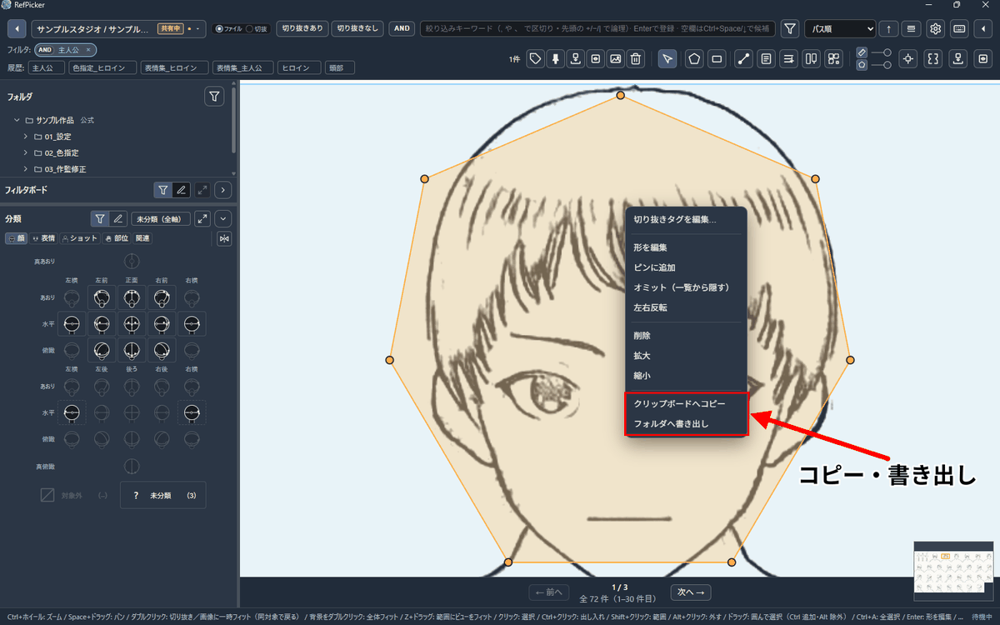

コピーとフォルダへの書き出しは<b>右クリック</b>から行います。

> 切り抜きは **一覧（表示単位 `切抜`）やピンに並べたまま**参照できます（3.1 の表示単位 / 4.1 のピン）。ここで説明するのは、**他アプリへ持ち出す**ときの書き出しです。

コピーとフォルダへの書き出しは、一覧の切り抜き上で右クリックし、メニューから実行します。ドラッグで渡すときはツールバーのボタンを使います。

- **クリップボードへコピー**:
  - 切り抜きを PNG ファイルとして一時フォルダに書き出し、その画像ファイルをクリップボードへコピーします
  - 他アプリへ貼り付ける用途です
- **フォルダへ書き出し**:
  - 指定したフォルダへ切り抜き PNG ファイルを保存します
- **ドラッグで渡す**:
  - ツールバーの選択ツールの左にある、ドラッグのボタン（**「書き出しを準備」**）を押すと、選んだ切り抜きの PNG を用意します
  - 用意ができたら、そのボタンを他のアプリへドラッグします。ファイルはコピーとして渡ります。
  - 用意している間にもう一度押すと中止します

> クリップボードやドラッグで渡すために書き出した PNG は、次に RefPicker を起動したときに消えます。ファイルとして残すときは **「フォルダへ書き出し」** を使ってください。

## 6. 一覧から外す（探索から除外・オミット）

一覧に出したくないものを外す方法は2つあります。

| | 探索から除外 | オミット |
|---|---|---|
| 外す単位 | フォルダ・ファイル（左のルートツリーで） | 切り抜き・画像（一覧で） |
| 共有・移行 | 共有元が除外したものは、除外したまま配られます。移行にも含まれます | 自分の手元だけです。共有にも移行にも載りません |
| 戻す場所 | ルートツリーの目のアイコン | オミットビュー（[6.3](#63-オミットビュー)） |

### 6.1 探索から除外

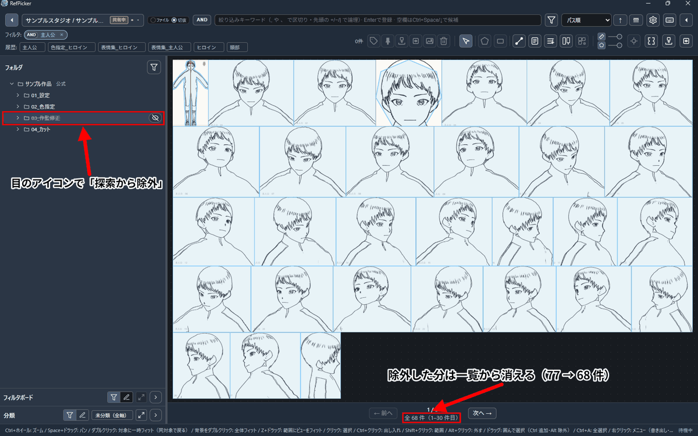

除外は<b>索引から消すのではなく、一覧に出さない</b>設定です。いつでも戻せます。

メイン画面左のルートツリーでは、フォルダ/ファイルを **「探索から除外」** にできます（目のアイコン）。

- 除外したパスは、一覧・フィルタ結果・切り抜き対象から外れます
- ディスク上の削除はしません
- ルート配下のディレクトリを除外すると、**その配下も除外**されます

**いまの絞り込みからだけ外すなら:** ツリーの行を **Alt＋クリック** すると、そのフォルダ（ファイル）を除いて絞り込みます（フィルタの NOT）。行のクリックはそのフォルダだけへの絞り込み、**Ctrl＋クリック** は OR、**Shift＋クリック** は AND で足します。どれもフィルタ語と同じく、条件を変えれば元に戻ります。

### 6.2 オミット

切り抜きや画像を、**削除せずに一覧から隠す**操作です。受け取った資料（公式）の切り抜きは削除できないので、要らないものはオミットで片付けます。

- 切り抜き: **Alt＋中クリック**、選んでツールバーのオミットのボタン、または右クリックの **「オミット（一覧から隠す）」**
- 画像: 画像の上で **Alt＋中クリック**、または右クリックの **「この画像をオミット」**
- 隠れるのは自分の一覧だけです。共有にも移行にも載らず、ほかの人の一覧は変わりません
- 切り抜きの形が変わったり、画像が差し替わったりすると、オミットは自動で外れます
- ピン表示と対比表には、オミットしたものも残ります

### 6.3 オミットビュー

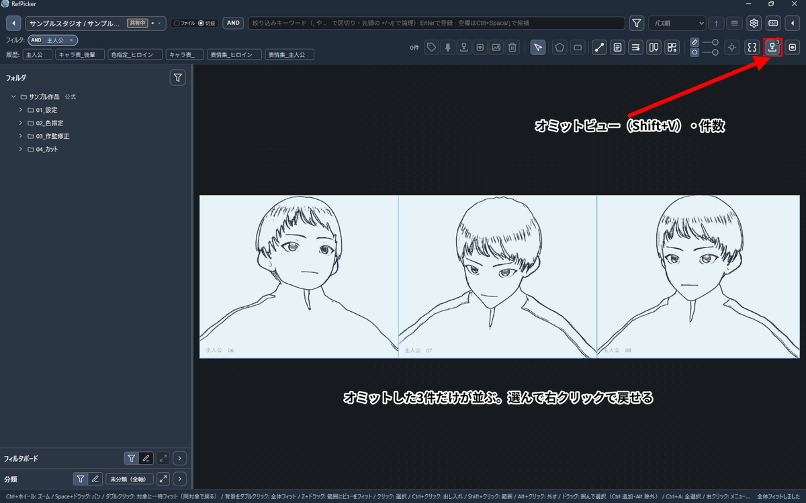

オミットしたものは<b>ここで戻せます</b>。削除はされていません。

ツールバーのオミットビューのボタン（**「オミットされたアイテムを表示」**）か **Shift+V** で、オミットしたものだけが中央に並びます。ボタンの数字は、オミットしている件数です。

- オミットした新しい順に並びます
- 戻すときは、ここで同じ操作（**Alt＋中クリック**、または右クリックの **「オミットを解除」**）をします
- もう一度ボタンを押すと通常の一覧に戻ります。フィルタ語や分類の選択を変えたときも戻ります

## 7. プロジェクトの移行
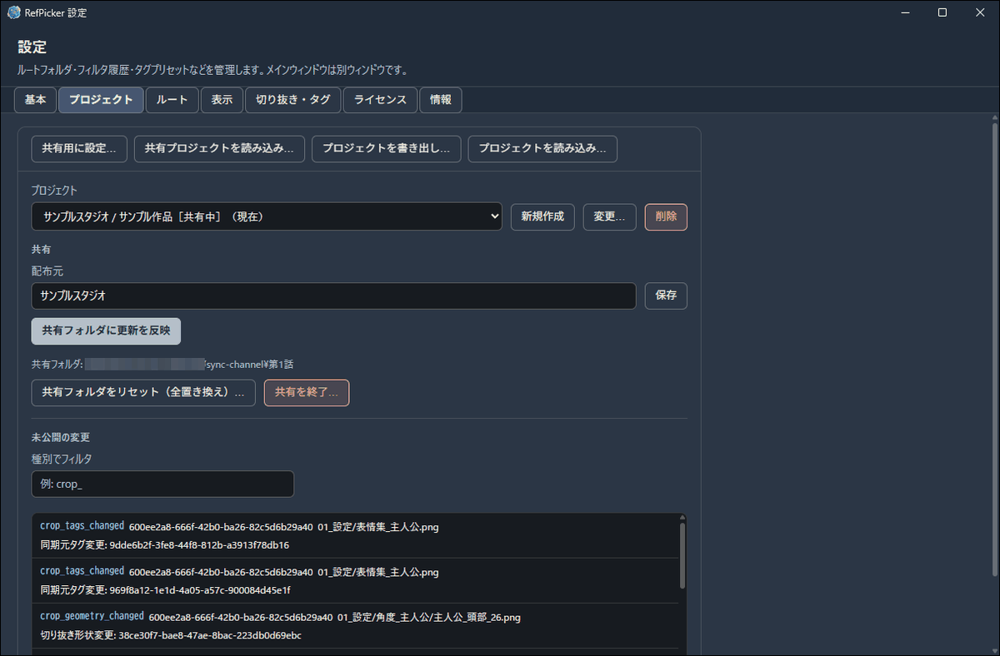

移行は<b>共有とは別のボタン</b>です。同じツールバーの右2つ。

別PCへ **プロジェクト一式**（公式＋個人ルート・切り抜き・メジャー・除外・**画像同梱**）を移すには、設定「プロジェクト」タブのツールバーから:

1. 移行元PCで **「プロジェクトを書き出し…」** → 単体ZIPに丸ごと書き出す。
2. 移行先PCで **「プロジェクトを読み込み…」** → その移行ZIPを選ぶ。**編集可能な新規プロジェクト**として取り込まれる。

共有（[同期ガイド](SYNC_GUIDE.md) の 公開／受け取り＝購読・読み取り専用・バージョン更新）とは**別系統**です。継続的にバージョンを揃えたいなら共有、まるごと持っていって続きを編集したいなら移行を使います。移行で読み込めるのは **「プロジェクトを書き出し…」** で作った移行用 ZIP だけです（共有フォルダは読み込めません。共有を受け取るときは **「共有プロジェクトを読み込み…」** を使います）。読み込んだプロジェクトは公式データも含めて編集できる新しいプロジェクトになり、元のプロジェクトや共有フォルダには影響しません。すでにルートを登録した自分のプロジェクトがある端末で読み込むときは、個人ライセンスが必要です（新しい PC での最初の読み込みは無料です）。

**受け取ったプロジェクトは書き出せません。** 公式データは共有元のものなので、移行 ZIP には含めません。別の PC で使うときは、その PC で **「共有プロジェクトを読み込み…」** から共有フォルダを受け取り直してください。

---

**ここまでが、資料を見ながら描く立場の人（原画・動画・作画監督など）の範囲です。**
以降の2章は、**資料・プロジェクトのデータを作る・配る側**（制作進行・設定制作など）の作業です。
受け取った資料を使うだけなら、[11. よくあるつまずき](#11-よくあるつまずきトラブルシュート) まで飛ばして構いません。

---

## 8. メジャー・正規化 ＜資料を作る側＞

**この章は、資料・プロジェクトのデータを作る人向けです。**

キャラごとに「頭の先から足先まで」のような**基準の線**（メジャー）を引いておくと、
別々の画像・別々の縮尺で描かれた絵を、**同じ大きさへ揃えて**並べられます。
その結果を書き出したものが [9. 対比表](#9-対比表-資料を作る側) です。

### 8.1 メジャーの割り当て（メジャーツール）

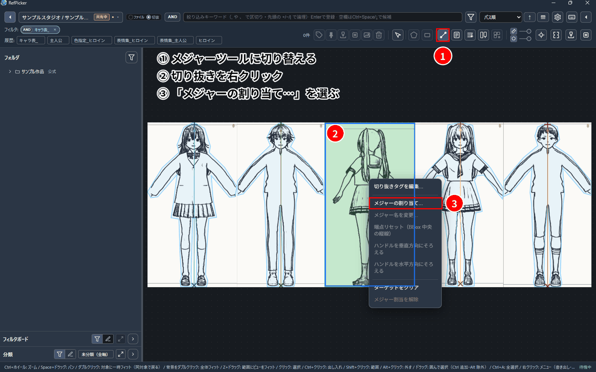

メジャーは「この絵のこの線を、比較の基準にする」という宣言です。<b>1つの切り抜きに1本</b>割り当てるというルールです。

メイン画面でツールを **「メジャー編集」** に切り替え、切り抜き上で右クリックしてメニューから実行します。

- **メジャーの割り当て…**
  - 複数選択にも対応（件数表示あり）
  - 既に割り当てがある場合は端点位置を維持してメジャーだけ差し替えます
  - 未割り当ての場合、端点は **BBox 左右中央の縦線（下端→上端）** に初期配置されます
- **メジャー名を変更…**（単一対象、割り当て済みのみ）
- **端点リセット（BBox 中央の縦線）**
- **ハンドルを垂直方向にそろえる / 水平方向にそろえる**
- **メジャー割当を解除**（割り当て済みのみ）

### 8.2 クリップ正規化ウィンドウ

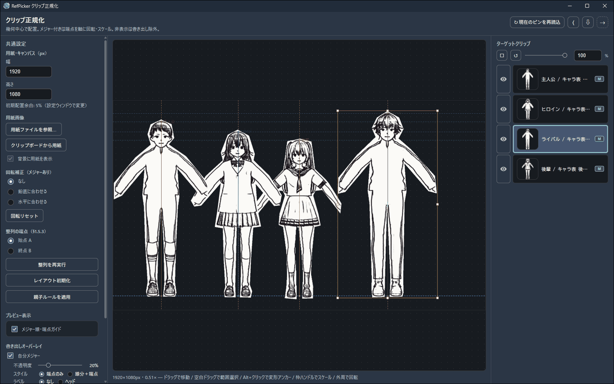

別々の画像・別々の縮尺で描かれた絵を、メジャーを軸に<b>同じ大きさへ揃えて</b>重ねます。

メイン画面のツールバーの **「クリップ正規化ウィンドウを開く」** から開きます。

**並ぶもの:** 右サイドバーで選んでいるピングループの、切り抜きのピンです（画像ピンは入りません。[4.4](#44-ピンに集めて並べるピン表示)）。右サイドバーのピンの各行のチェック（**「クリップ正規化ウィンドウへ送る」**）を外したものは入りません。送るピンが1つも無いときは、一覧で選んでいる切り抜きが並びます。開いたあとでピンを足したときは、ウィンドウの **「現在のピンを再読込」** で取り直せます。

**画面の構成:**

- **左ペイン**: 用紙・キャンバス、用紙画像、回転補正、整列端点、プレビュー表示
- **中央**: キャンバス（ドラッグで移動）
- **右ペイン**: ターゲットクリップ（表示/非表示、並び替え、選択の編集、プリセット）

メジャーを割り当てたクリップは、**基準メジャーとの比**でサイズが揃って表示されます。
**最終的な出力サイズ**は、このウィンドウのスケール・キャンバス寸法・配置で決めてください。

#### 書き出し

- 右上の **「フォルダへ書き出し…」**（⇩）: 合成した PNG をフォルダへ保存（非表示クリップは除外）
- 右上の **「ドラッグで書き出し」**（⇢）: ドラッグ開始で合成 PNG をまとめてドラッグ（Windows のみ、非表示は除外）

#### よく使う設定

- **用紙・キャンバス（px）**: 書き出し解像度（論理キャンバス）
- **用紙画像**: 編集ビュー用の下絵（プレビュー上のみ。書き出し PNG には含めません）
- **回転補正（メジャーあり）**: なし / 鉛直に合わせる / 水平に合わせる
- **整列の端点**: 始点A / 終点B（メジャー付きの整列や回転・スケールの軸）
- **ターゲットクリップ**: 目のアイコンで表示/非表示（非表示は書き出し除外）

#### 書き出しオーバーレイ（メジャーの焼き込み）

書き出した PNG 画像に、**メジャーを薄く焼き込んでおく**ことができます。外部エディタで対比のガイドとして使うことを目的とした機能です。例えば、レイアウトでキャラクターの対比を把握するのに役立つかもしれません。

既定では、そのクリップ自身のメジャーと、同時に書き出す他のクリップのメジャーの両方が、**薄い端点だけ**で入ります。左ペインでそれぞれ **表示/非表示・濃さ・線の出し方・名前の有無** を変えられます。色はメジャーの色のままです。

### 8.3 メジャー管理ウィンドウ

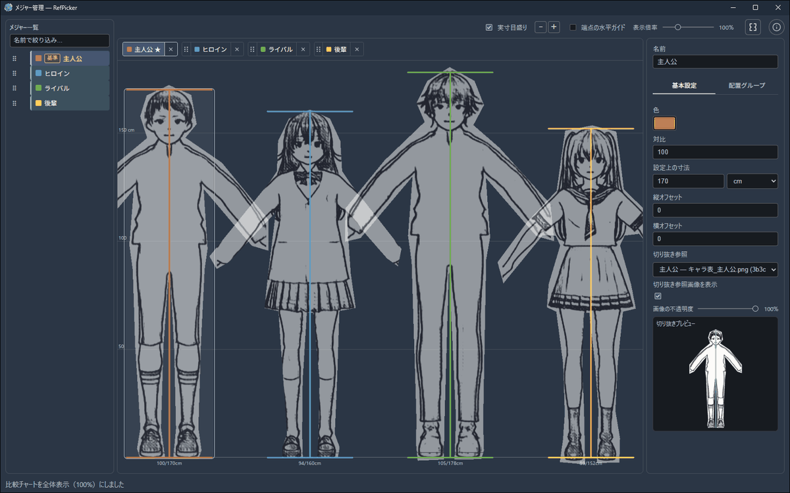

★が基準です。基準を決めてから、ほかのメジャーの対比を見ます。

ツールバーの **「メジャー管理ウィンドウを開く」** から、メジャー定義と比較チャートを編集します。

- **対比 S（スケールの略）** — 基準メジャーに対する相対スケール（比較チャートの棒の高さ・ドラッグで調整）
- **設定上の寸法** — 基準メジャーにだけ、身長などの実寸を入れられます。入れると他のメジャーの寸法は対比から計算され、比較チャートに実寸の目盛りを出せます
- **基準メジャー** — 一覧・右クリックまたは比較 UI から指定（★ 表示）

## 9. 対比表 ＜資料を作る側＞

**この章も、配る資料・プロジェクトデータを作る人向けです。**

対比表は**キャラ対比**の表です。メジャーを割り当てた切り抜きを**共通の地面**（ベースライン）に
並べ、左端の目盛り・頭上のキャラ名・タイトルまで焼き込んだ **1 枚の PNG** を作ります。

[8.2 クリップ正規化](#82-クリップ正規化ウィンドウ) がその場で1枚に揃える作業なのに対し、対比表は**別ウィンドウ・別データ**として残ります。

前提: 対比表に並べる切り抜きには **メジャーが割り当てられている**必要があります。
未割当の切り抜きは、追加するときにスキップされます（[8.1](#81-メジャーの割り当てメジャーツール) で割り当ててください）。

### 9.1 作成（対比表エディタ）

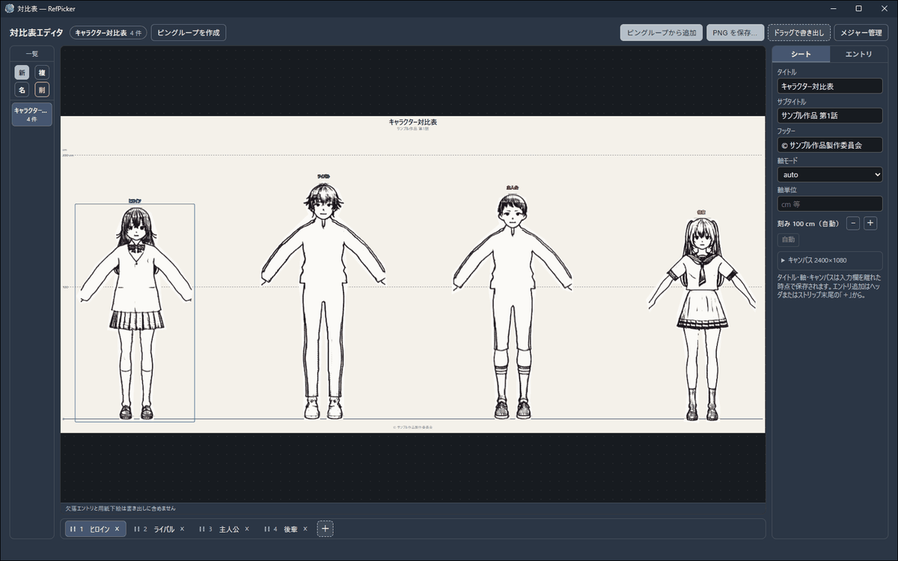

元の設定やメジャーを直せば、次に開いたとき<b>作り直されます</b>。

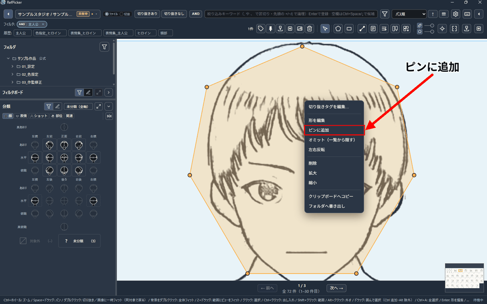

対比表に入れる切り抜きは、まず<b>ピン</b>に集めます。

**作る手順:**

1. メイン画面で対象の切り抜きにメジャーを割り当てる（[8.1](#81-メジャーの割り当てメジャーツール)）
2. 右サイドバーのピングループの選択欄で、使う **ピングループ** を選ぶ（**「新しいピングループ」** で作れます。[4.4](#44-ピンに集めて並べるピン表示)）
3. 対比表に入れる切り抜きを **ピン** する（中クリック、または右クリック → **ピンに追加**）
4. ツールバーの **「対比表エディタを開く」** からエディタを開き、左の **新規** で対比表を作る
5. **「ピングループから追加」** でピングループを選び、入れる切り抜きにチェックして追加する

**エディタの画面構成:**

- **左**: 対比表一覧（新規 / 複製 / 改名 / 削除）
- **右**: タイトル・軸・キャンバス設定、プレビュー、エントリ並べ替え、エントリ編集、PNG 書き出し

### 9.2 ピックアップ（フィルタ／ピン）

- **フィルタ語**で一覧を絞り込み、必要な切り抜きだけをピンする運用が基本です
- あとから足すときも **「ピングループから追加」** を使います
- メジャー未割当の切り抜き・画像のピン・すでに入っている切り抜きはスキップされ、件数が表示されます
- 逆に、対比表のエントリから **「ピングループを作成」** で新しいピングループを作れます（作ったグループがアクティブになります）
- エントリは元の切り抜きとメジャーに紐づいています。元の切り抜きやメジャーを直すと、対比表を開いたときに最新の見た目で再構成されます

### 9.3 並べ替えとエントリ編集

並び順とラベルは<b>エントリごと</b>に直せます。

対比表エディタ右側のエントリ一覧で操作します。

- **ドラッグで並べ替え**: 各行左のハンドルをドラッグし、順序を入れ替えます（横並びの順になります）
- **ラベル上書き**: 頭上に出す名前（空なら導出ラベル）
- **実寸値を副次表示**: 実寸または相対値を副次表示します
- **副次ラベル / タグ**: 衣装名など任意の一行
- **縦オフセット / 列幅比**: メジャーが足元まで届かない場合などの補正と、列の横位置の調整

参照先の切り抜きが削除されたエントリは **欠落**（⚠）として残り、プレビューではプレースホルダ表示になります。警告一覧から削除できます。

### 9.4 目盛り・ラベル・タイトル

右側の **タイトル / 軸 / キャンバス** パネルで設定します（入力はプレビューへ即反映され、**入力欄を離れた時点で保存**されます）。

| 項目 | 内容 |
|------|------|
| タイトル / サブタイトル / フッター | 焼き込み文言（空なら描かない）。フッターに © 表記などを置けます |
| 軸モード | `auto`（実寸可能なら実寸、そうでなければ相対）/ `realUnit` / `relative` / `hidden` |
| 軸単位・min / max / step | 実寸軸の表示単位と目盛り範囲（空欄は自動） |
| キャンバス幅・高 | 出力 PNG の論理ピクセルサイズ |
| 列間隔比 | エントリ間のすき間 |

基準メジャーはメジャー管理ウィンドウで指定したものを使います（相対軸では 100＝基準）。

### 9.5 書き出し・配布

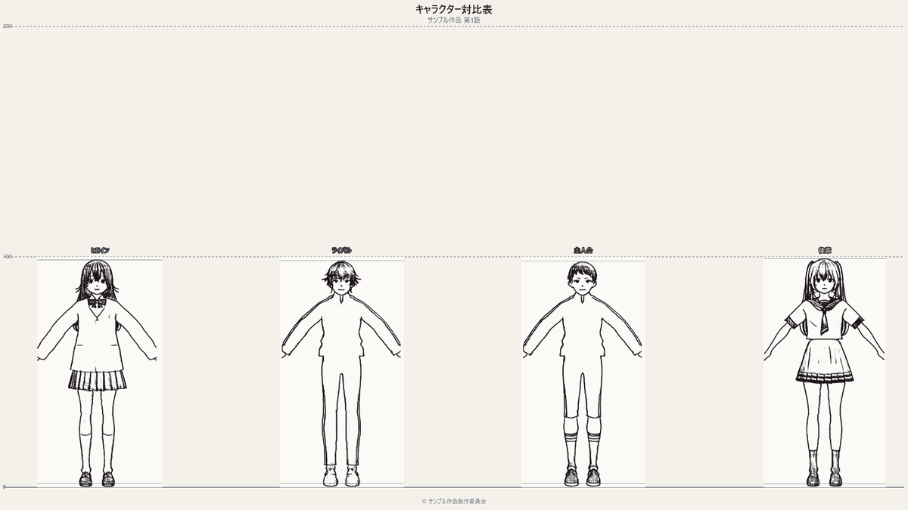

書き出した1枚には<b>目盛りと名前とタイトルが焼き込まれています</b>。そのまま配れます。

プレビュー直上の操作です。

- **PNG を保存…**: 保存ダイアログでパスを選び、目盛り・罫線・ラベル・タイトル込みの単一 PNG を書き出します（既定ファイル名は対比表名）
- **ドラッグで書き出し**: チップをドラッグし、エクスプローラーや他アプリへ PNG を渡します（Windows のみ）

注意:

- **欠落エントリは書き出しに含まれません**。欠落がある場合は確認ダイアログが出ます
- 用紙下絵は対比表にはありません（クリップ正規化の用紙画像とも無関係です）
- 配布物は静止画 PNG です。編集可能な対比表ドキュメント自体の同期配布は対象外です

### ここが押せない場合

| 症状 | 確認 | 解決 |
|------|------|------|
| 「ピングループから追加」で入らない | メジャー未割当／画像のピン／追加済み | 8.1 でメジャーを割り当てる／切り抜きをピンする |
| PNG を保存… が無効 | 書き出し可能なエントリが 0 件 | 欠落でないエントリを 1 件以上入れる |

## 10. データの保存場所

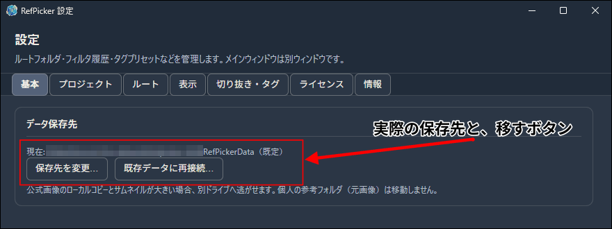

「現在」の行が、いま使っている保存先です。

データベース・キャッシュ・一時エクスポートは、**データ保存先**（データルート）の配下に保存されます。
既定は **`RefPicker.exe` と同じフォルダの `RefPickerData`** です。
実際のパスは 設定 →「基本」→ **「データ保存先」** で確認でき、そこで別の場所へ移せます。
ライセンス認証の状態はこのフォルダに含まれません（別の PC へ移したときは、移した先で認証し直してください）。

> ⚠ **更新のときに解凍先フォルダごと消すと、このデータも消えます。**`RefPicker.exe` だけを
> 上書きしてください（[QUICKSTART.md](./QUICKSTART.md)）。

- `projects.json`（プロジェクト一覧）
- `projects/<projectId>/crossref.db`（プロジェクトごとの SQLite）
- `projects/<projectId>/thumbs/`（サムネキャッシュ）
- `projects/<projectId>/exports/`（クリップボードやドラッグで渡す PNG。次の起動で消えます）

サムネイルと表示用のキャッシュは、起動後とプロジェクトの切り替え後に自動で片付きます（使われなくなったものだけを消します）。

## 11. よくあるつまずき（トラブルシュート）
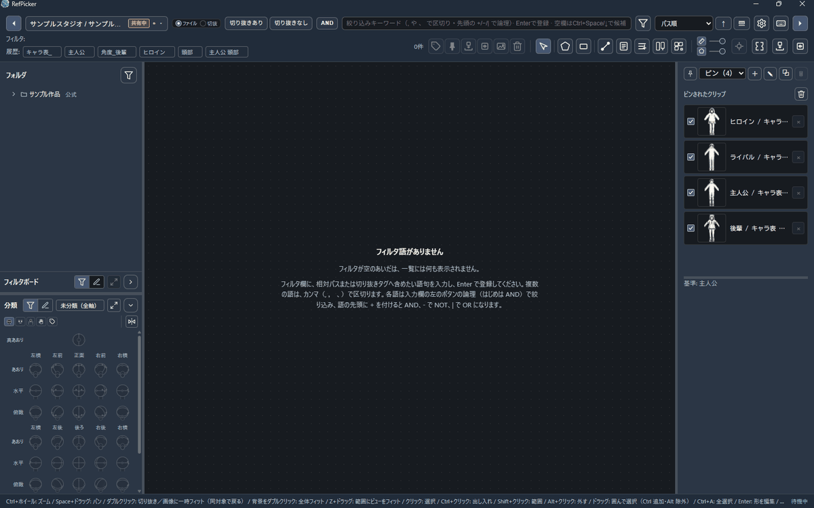

<b>語を入れて Enter</b> を押すまで一覧は出ません。

### 一覧に何も出ない

- フィルタ語が空だと一覧は表示されません。入力欄に語句を入れて **Enter で登録**してください。
- ルートが未登録の場合は、設定でルートを追加してスキャンが完了するまで待ってください。

### 「切り抜きの新規作成」ができない

- 表示単位が `切抜` のときは新規作成できません。`ファイル` に切り替えてください。

### クリップボードへコピーしたのに貼り付けできない

- クリップボードには画像ファイルとして入ります。貼り付け先アプリがファイルの貼り付けに対応しているか確認してください。
- コピーしたあとに RefPicker を起動し直していないか確認してください。書き出した PNG は次の起動で消えるので、もう一度コピーしてください。

### 別のプロジェクトを更新しても、今の一覧は変わりません

- 通常、**開いているプロジェクトだけ** 一覧が自動更新されます。別のプロジェクトへの適用はバックグラウンドで完了し、切り替えたときにそのプロジェクトの内容が表示されます。

### 取り込みが「購読先 (…) が一致しません」で拒否される

- 配布データは **対応するプロジェクト** にだけ適用できます。別のプロジェクトの共有フォルダを選んでいないか、プロジェクト切替で正しいプロジェクトを選んでから、もう一度プレビュー・適用してください。
- 自分で作った（共有元の）プロジェクトには取り込めません（**「対象は受け取りプロジェクトではありません（発行元プロジェクトには取り込めません）」**）。受け取り用のプロジェクトを選んでください。

### 更新バッジが付くが、更新できない

- 共有フォルダのパスが正しいか、共有元が最新のバージョンを反映済みかを確認してください。プロジェクトごとに**別の共有フォルダ**を記憶しているので、取り違えていないかも確認してください。詳しくは [同期ガイド](SYNC_GUIDE.md) のトラブルシュートを参照してください。
